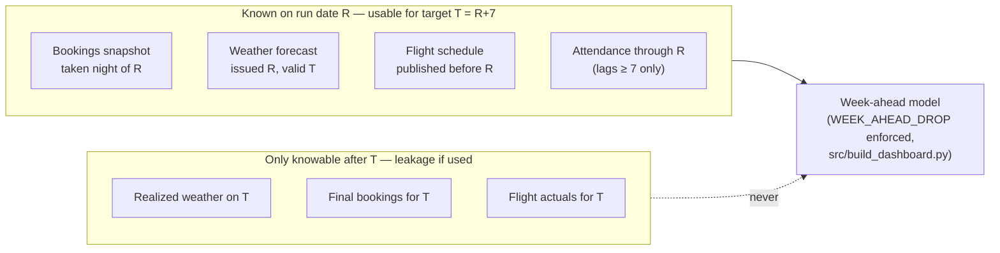

# Chapter 1 — Data sources & contracts

Every input the model reads is either **yours** (ticketing, bookings) or **external**
(flights, weather, calendars). This chapter fixes the contract for each: grain, keys,
freshness, snapshot shape, and licensing. The one rule that repeats: anything that changes
over time — bookings on file, weather forecasts, flight schedules — is stored **as-of**,
keyed by the date the value was observed, never overwritten. That is ground rule 2 in the
[guide index](README.md) and it is what makes backtests honest.



## 1.1 Your ticketing / admission data

This is the bring-your-own part: it replaces the Kaggle attendance file that
`src/pipeline.py::load_attendance` parses in the PoC. Two acceptable grains:

| Grain | Status | Shape |
|---|---|---|
| Per-admission event (one row per gate scan) | **Preferred** | Enables intraday analysis later, robust dedup, clean operating-day derivation |
| Daily aggregate | Acceptable minimum | One row per `(park_id, operating_date, ticket_type, sales_channel)` with a `quantity` sum |

Minimal ingest contract (per-admission grain; the daily grain drops `admission_ts`/`gate`
and adds `operating_date`):

| Column | Type | Required | Notes |
|---|---|---|---|
| `source_event_id` | text | yes (event grain) | The ticketing platform's scan/transaction id — the dedup key |
| `admission_ts` | timestamptz | yes | Moment the guest crossed the gate, with UTC offset |
| `sale_ts` | timestamptz | strongly recommended | Moment the ticket was **sold** — see below |
| `park_id` | text | yes | Multi-park ready even with one park |
| `gate` | text | optional | Useful for reconciliation, not used by the model |
| `ticket_type` | text | yes | day / season-pass / comp / group — lets you exclude non-demand entries |
| `sales_channel` | text | yes | online / onsite / OTA / group |
| `quantity` | integer | yes | 1 per scan; >1 allowed for group-ticket transactions |

**`sale_ts` vs `admission_ts` is the load-bearing distinction.** The model's *target* is
admissions per operating day (`admission_ts`). The *advance-booking features* (§1.2) are
built from `sale_ts` relative to the visit date. Collapsing the two — e.g. computing
"tickets sold for date T" over all sales including those made inside the final week — puts
future information into the week-ahead model. The notebook demonstrates exactly this
failure: a fake bookings feature derived from the target ranks #1 in importance and
inflates accuracy (`notebooks/ThemePark_Attendance_XGBoost_with_Flight_Features.ipynb`,
"leakage demonstration").

**Dedup and idempotency.** Land raw rows append-only with a `load_id`; staging dedups on
`source_event_id` keeping the latest load ([chapter 2](02-warehouse.md)). If the platform
has no stable event id, hash `(park_id, gate, admission_ts, ticket_type, quantity)` and
accept that two genuinely identical simultaneous scans collapse — at daily-aggregate
grain, the natural key is simply `(park_id, operating_date, ticket_type, sales_channel)`
with `INSERT ... ON CONFLICT ... DO UPDATE` (works in both PostgreSQL and DuckDB).

**Late and corrected data.** Offline turnstiles buffer scans and sync hours later; online
sales reconcile against gate counts days later; refunds and voids mutate history. So the
nightly ingest re-extracts a trailing window (D−7 through D), not just yesterday, and
upserts. Staging's daily totals are therefore allowed to change for up to 7 days; the
accuracy scorer in [chapter 5](05-operations.md) re-scores that window nightly for the
same reason. Anything older than the window that still changes is an incident, not a
silent update.

**Operating day.** A 00:30 scan during a late closing belongs to the *previous* operating
date. Derive `operating_date` from `admission_ts` in the park's local timezone with an
early-morning cutoff (04:00 by default): `Europe/Madrid` for PortAventura,
`America/New_York` for a Florida park. The exact rule, DST handling included, is specified once in
[chapter 2](02-warehouse.md) and used everywhere.

**PII.** The pipeline needs **no personal data** — no names, emails, payment tokens, or
plate numbers. Aggregate or strip before landing: the columns above are sufficient and
none identifies a person (a scan-event id is pseudonymous at worst; drop it at the
staging boundary once deduped). This keeps the warehouse outside most GDPR processing
questions (data minimization, Art. 5(1)(c)) in the EU, and outside CCPA/CPRA-style state
privacy laws in the US, because aggregate visitation counts are not personal information.
Scope the claim precisely when presenting it: it covers **guest** data. The system does
hold two small sets of *staff* identifiers later in the build — the planner-override log's
`entered_by` ([chapter 6](06-rollout.md)) and the Power BI row-level-security mapping's
`user_upn` ([chapter 4](04-powerbi.md)) — which are personal data under GDPR and belong in
the record of processing with access limited and retention tied to employment. Get your
DPO's sign-off on the ingest contract in writing, and revisit it when the override log
ships in Phase 2.

## 1.2 Advance-booking snapshots — the highest-value addition

The PoC has no booking data; the pipeline ships the hook for it (`Booked_*` in
`src/pipeline.py::feature_group`, and `merge_booking_snapshots()` in the notebook, which
produces `Booked_AsOf_{H}d` columns for horizons 1/7/30). **This is the single
highest-value feature production adds**: bookings-on-file seven days out is a direct
measurement of the demand the model otherwise infers from proxies.

The only leakage-safe shape is a nightly **as-of snapshot** — cumulative bookings per
future visit date, keyed by the night the snapshot was taken:

```sql
-- Canonical DDL lives in chapter 2 §2.3 (raw.booking_snapshots): columns
-- (park_id, snapshot_date, target_date, channel, bookings, source, _batch_id,
-- _loaded_at). target_date is the future date the tickets are for; bookings is
-- the cumulative count on file, not that day's sales.

-- "Booked_AsOf_7d": what was on file exactly 7 days before each visit date.
-- date - integer arithmetic works in both PostgreSQL and DuckDB.
SELECT target_date, park_id, SUM(bookings) AS booked_asof_7d
FROM raw.booking_snapshots
WHERE snapshot_date = target_date - 7
GROUP BY target_date, park_id;
```

The week-ahead model consumes this as the feature `Booked_AsOf_7d`; the day-ahead model
adds `Booked_AsOf_1d`; a `Booked_vs_LY_Ratio` (bookings on file vs the same point last
year) is the natural third. The notebook's `merge_booking_snapshots()` shows the general
`Booked_AsOf_{H}d` construction for any horizon.

Why snapshots and not a query against the sales table? Because "bookings for T as of
T−7" reconstructed later from `sale_ts` silently absorbs cancellations, refunds, and
data-model changes that had not happened yet at T−7. A snapshot is what the system
actually knew that night; it is immutable, so backtests replay it exactly (ground
rule 2). Take it nightly for the next 120 visit dates; never update a past snapshot.
Start capturing snapshots **now, before the rest of the build** — the model can only
train on booking features for dates where snapshots exist, so every week of delay is a
week of the best feature's training history lost.

## 1.3 Flights

**What the PoC uses.** EUROCONTROL AIU airport-traffic CSVs — monthly-updated *actuals*
of IFR arrivals/departures per airport, published per year from 2016 onward, fetched from
the URL pattern in `src/pipeline.py`:

```python
EUROCONTROL_CSV = ("https://www.eurocontrol.int/performance/data/download/csv/"
                   "airport_traffic_{year}.csv")
```

`build_flight_window_features()` turns the daily counts into `Arr_`/`Dep_` ×
`Last/Curr/Next` × `Day/Week/Month` windows, plus momentum ratios
(`Arr_Week_Momentum = Arr_Next_Week / Arr_Last_Week`, etc.).

**The honest problem.** In the PoC, `Curr_*` and `Next_*` windows are computed from
*actuals* — a stand-in that is defensible only because airline schedules publish months
ahead, so a schedule feed would have carried nearly the same numbers (see the caveat in
the repo [README](../../README.md)). Production must not keep the shortcut:

- **Future windows (`Curr_*`, `Next_*`, and the momentum ratios) come from published
  schedules**, snapshotted as-of the run date. Commercial vendors: **OAG** or **Cirium**
  (both paid, both cover EU and US); some airports publish seasonal schedule files that
  can work for a single-park deployment. Without a schedule feed, drop the forward
  windows and the feature set degrades to trailing (`Last_*`) windows only — you keep
  "how strong was inbound traffic recently" but lose "a surge is scheduled for next
  week," which is precisely the signal the week-ahead horizon needs. Before signing a
  vendor contract, quantify the loss on your own data: run `src/backtest.py` with
  `Curr_*`/`Next_*` columns dropped and compare week-ahead MAE.
- **Actuals remain useful for trailing windows, training history, and backfill.** Note
  the freshness catch: EUROCONTROL publishes monthly, so at daily inference even
  `Last_Day`/`Last_Week` are stale by weeks unless the schedule feed also covers the
  recent past (vendor feeds do) or you accept the staleness.

**US equivalents for actuals** (there is no US EUROCONTROL clone; combine):

| Source | What it is | Cadence / lag | Cost |
|---|---|---|---|
| BTS T-100 segment data | Passenger counts per route/carrier/airport — the only *per-airport* passenger actuals | Monthly, **~2-month lag** — training/backfill only | Free, public domain |
| FAA ASPM / OPSNET | Airport operations counts (movements) | Daily, ~1-day lag | Free (registration for some views) |
| TSA checkpoint throughput | Daily screened-passenger totals — a demand proxy | Daily posts, a few days' lag; national totals, not per-airport | Free, public domain |

**Airport mapping** — pick 1–3 airports by where your visitors actually originate
(visitor-survey data beats guessing), mirroring `PARK_AIRPORTS` in `src/pipeline.py`:

| Park | Airports (IATA/ICAO) | Note |
|---|---|---|
| PortAventura World (Salou, ES) | BCN/LEBL + REU/LERS | Repo default: primary + local secondary |
| Tivoli Gardens (Copenhagen, DK) | CPH/EKCH | Repo's second configured park |
| A Florida park (Orlando area) | MCO/KMCO primary; SFB/KSFB, TPA/KTPA secondary | Weight by visitor origin |

**Licensing caveat.** EUROCONTROL performance data is freely downloadable, but its terms
of use for commercial redeployment should be **verified with EUROCONTROL before a paid
production system depends on it** — do not assume "downloadable" means "licensed for
commercial use." BTS, FAA, and TSA data are US-government works (public domain).
OAG/Cirium are commercial contracts with their own redistribution limits.

## 1.4 Weather

Two distinct datasets that must never be conflated:

1. **History (training):** realized daily observations for the full training window.
   EU + US: **Open-Meteo** historical/archive API. US alternative with public-domain
   status: **NOAA NCEI** station history (GHCN-Daily).
2. **Forecast snapshots (features):** what the forecast *said*, stored the day it was
   issued. The week-ahead model must be trained and scored on "the forecast for T as of
   T−7," not realized weather. The PoC uses realized weather everywhere and flags it as
   flattering (dashboard footer, repo README) — this table is the production fix:

The canonical DDL is `raw.weather_forecast_snapshots` in [chapter 2 §2.3](02-warehouse.md):
keyed by `(station_id, snapshot_date, target_date, source)` — stations map to parks via
`ref.park_stations` — with the forecast variables (`temp_max_c`, `temp_min_c`,
`precip_mm`, `wind_speed_ms`, `clouds_pct`, `humidity_pct`) stored as issued.

Fetch daily for the next 10–14 target days; append-only. Until real snapshot history
accumulates, you can *approximately* backfill training with realized history minus a
noise haircut, but label it and swap it out — never backfill snapshots from actuals and
call them forecasts.

Map vendor variables onto the pipeline's `WEATHER_AGG` output names
(`src/pipeline.py`) so the feature frame is byte-compatible with the PoC:

| Pipeline feature (agg) | Open-Meteo daily/hourly | NWS `api.weather.gov` | Unit watch |
|---|---|---|---|
| `Avg_Temp_C` (mean) | `temperature_2m` hourly mean | gridpoint `temperature` | NWS gridpoints return SI (°C already) |
| `Max_Temp_C` (max) | `temperature_2m_max` | `maxTemperature` | |
| `Min_Temp_C` (min) | `temperature_2m_min` | `minTemperature` | |
| `Avg_Humidity_pct` (mean) | `relative_humidity_2m` mean | `relativeHumidity` | |
| `Total_Rain_mm` (sum) | `precipitation_sum` | `quantitativePrecipitation` | inches → mm |
| `Avg_Wind_ms` (mean) | `wind_speed_10m` mean | `windSpeed` | both default km/h → m/s (NWS `/gridpoints` is SI; °F/mph appear only on the human-readable `/forecast` endpoints) |
| `Avg_Clouds_pct` (mean) | `cloud_cover` mean | `skyCover` | |

**Licensing.** Open-Meteo's free tier is **non-commercial**; a production deployment for
a park company needs one of its paid commercial plans (they exist and are cheap relative
to this project). NWS/NOAA data are US-government public domain — free for commercial
use, US locations only. European national met services (AEMET for Spain, DMI, DWD, …)
publish open data under varying terms; usable as a second source, verify per-service.

## 1.5 Holidays & school calendars

**Public holidays** are solved by the `holidays` pip package (MIT-licensed), already
wired in `src/pipeline.py::PARK_HOLIDAYS` with subdivision support:

```python
import holidays
es_ct = holidays.country_holidays("ES", subdiv="CT")   # Spain / Catalonia (repo default)
us_fl = holidays.country_holidays("US", subdiv="FL")   # US federal + Florida
```

US federal holidays alone are not enough — state observances and the *distance-to-holiday*
features (`Days_To_Holiday`, `Is_Bridge_Day` in `add_pack2_features`) need the subdivision
calendar. Pin the package version; holiday law changes, and a silent calendar shift is a
feature drift you want to see in a diff, not discover in the bias panel.

**School calendars** are the repo README's **single highest-value missing feature**, and
that carries forward unchanged: school breaks move family attendance more than almost
anything else the model currently sees. No API covers them reliably in either region, so
maintain a small dimension table by hand — it is ~20 rows per feeder region per year,
refreshed each summer from official publications:

```sql
CREATE TABLE raw.dim_school_breaks (
  region      TEXT NOT NULL,   -- 'ES-CT', 'FR-zone-C', 'US-FL-orange', ...
  break_name  TEXT NOT NULL,   -- 'summer', 'easter', 'fall-break', ...
  start_date  DATE NOT NULL,
  end_date    DATE NOT NULL,
  school_year TEXT NOT NULL,   -- '2026-2027'
  PRIMARY KEY (region, break_name, school_year)
);
```

Official sources: **EU** — the Catalan education department's published school calendar
(Generalitat de Catalunya) for a Catalonian park, plus the French Ministry of Education's
zone A/B/C calendar for French feeder markets; most EU countries publish equivalents.
**US** — school calendars are set per district: pull the district calendars for your top
feeder counties (e.g. Orange County Public Schools for an Orlando park) plus the
spring-break weeks of your biggest out-of-state feeder markets. The feature is simple:
share of feeder regions on break per date, or one indicator per major region.

## 1.6 Licensing & cost summary

| Source | Region | Cost | Commercial use | Cadence | Lag | Role |
|---|---|---|---|---|---|---|
| Your ticketing platform | both | internal | yours | nightly (trailing-7 re-extract) | none | Target + booking snapshots |
| EUROCONTROL AIU airport traffic | EU | free download | **verify terms before relying on it commercially** | monthly | ~1 month+ | Flight actuals: training, backfill, trailing |
| OAG / Cirium schedules | both | **paid** | contract-licensed | daily/weekly feed | forward-looking | `Curr_*`/`Next_*` windows + momentum |
| BTS T-100 | US | free | public domain | monthly | **~2 months** | Passenger actuals: training/backfill only |
| FAA ASPM / OPSNET | US | free | US-gov data | daily | ~1 day | Trailing ops counts |
| TSA checkpoint throughput | US | free | public domain | daily posts | days; national only | Demand proxy / sanity check |
| Open-Meteo | both | free tier / paid | **paid plan required** (free tier is non-commercial) | hourly | none | Weather history + forecast snapshots |
| NWS `api.weather.gov` | US | free | public domain | hourly | none | Forecast snapshots (US) |
| NOAA NCEI (GHCN-D) | US+ | free | public domain | daily | days | Weather history (US) |
| `holidays` pip package | both | free | MIT | package releases | n/a | Holiday features |
| School calendars | both | staff time | official publications | annual refresh | n/a | `dim_school_breaks` |

The only mandatory line items for a commercial deployment are an Open-Meteo commercial
plan (or NWS-only for a US park, at zero cost) and — if the backtest justifies it — a
schedule feed. Everything else is free or already yours. Next:
[chapter 2](02-warehouse.md) turns these contracts into DDL and load jobs.
