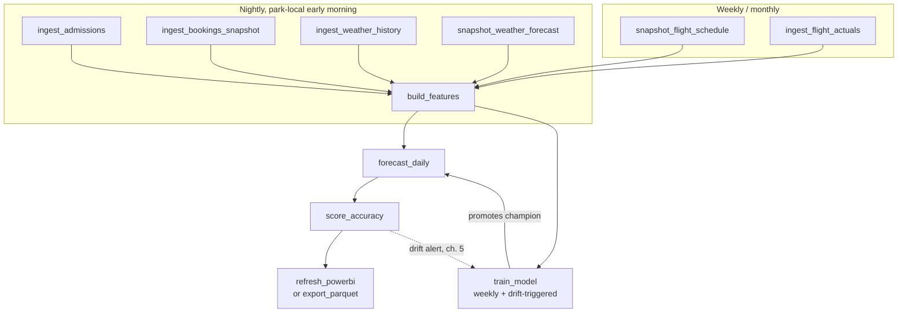

# Chapter 3 — Pipeline & modeling

[Chapter 1](01-data-sources.md) fixed what each source promises; [chapter 2](02-warehouse.md)
gave it a place to land. This chapter schedules the work: the job DAG, the feature
freshness contract that enforces the leakage firewall (ground rule 1 in the
[index](README.md)), the training/promotion loop, and the daily forecast service. The
model code is the repo's: `BlendModel` in `src/build_dashboard.py`, features from
`src/pipeline.py`, model selection evidence from `src/backtest.py`.

## 3.1 The job DAG



Crons below are **park-local** — `Europe/Madrid` for a Spanish park, `America/New_York`
for a Florida park; the same local clock times apply in either region. Retries use
exponential backoff. SLAs are the moment [chapter 5](05-operations.md)'s alerting starts
caring, not the typical finish time.

| Job | Cron (park-local) | Reads | Writes | Retries × timeout | SLA | On failure |
|---|---|---|---|---|---|---|
| `ingest_admissions` | `30 4 * * *` | Ticketing API, trailing D−7..D−1 re-extract (ch. 1) | `raw.admissions` → `staging.attendance_daily` | 3 × 15 min | staging complete through D−1 by 06:00 | Alert. Downstream still runs; features carry a staleness flag (ch. 5 thresholds) |
| `ingest_bookings_snapshot` | `45 4 * * *` | Ticketing sales API: bookings on file for next 120 visit dates | `raw.booking_snapshots` (append-only) | retry every 10 min until 05:45 | tonight's snapshot exists by 05:45 | Page. A missed night is an **unrecoverable gap** — snapshots cannot be backfilled |
| `ingest_weather_history` | `0 5 * * *` | Open-Meteo archive (EU/US) or NOAA GHCN-D / NWS obs (US), trailing 7 d | `raw.weather_history` | 3 × 10 min | by 06:00 | Alert next morning; fully backfillable, so low urgency |
| `snapshot_weather_forecast` | `0 5 * * *` — **fixed hour; the snapshot time is part of the contract** | Open-Meteo forecast (commercial plan) or NWS `api.weather.gov` (US), targets D+1..D+14 | `raw.weather_forecast_snapshots` (append-only) | retry every 10 min until 05:45 | snapshot dated D by 05:45 | Page. Unrecoverable gap; feature builder substitutes per ch. 5 policy |
| `ingest_flight_actuals` | EU: `0 7 5 * *` (monthly, after EUROCONTROL update) · US: monthly for BTS T-100 (**~2-month lag**) plus `0 7 * * *` for FAA ASPM/OPSNET daily counts | EUROCONTROL yearly CSV / BTS / FAA (ch. 1 §1.3) | `raw.flight_actuals` | 3 × 30 min | within 48 h of source publication | Alert; trailing-window training history ages, nothing breaks today |
| `snapshot_flight_schedule` | `30 5 * * 1` (weekly, Mon) | OAG or Cirium schedule feed (paid, both regions) | `raw.flight_schedule_snapshots`, keyed by `snapshot_date` | 3 × 20 min | before Monday's `build_features` | Alert; reuse last snapshot up to 14 d old, then drop `Curr_*`/`Next_*` features (ch. 1 §1.3 fallback) |
| `build_features` | `0 6 * * *` | `staging.*` + all snapshot tables | `marts.features_daily` | 2 × 15 min | by 06:30 | **Hard fail** on freshness-contract or DQ-gate violation (§3.3, ch. 5); `forecast_daily` then goes to fallback |
| `train_model` | `0 2 * * 1` (weekly) + drift-triggered (ch. 5) | `marts.features_daily`, model registry | candidate artifact + `marts.model_registry` row | 1 × 120 min | verdict (promoted/rejected) by Mon 06:00 | Champion stays; alert. Never block the daily forecast on training |
| `forecast_daily` | `30 6 * * *` | `marts.features_daily`, champion artifacts | `marts.forecasts` (append-only) | 3 × 15 min | rows for D+1..D+14 by 07:00 | Write fallback rows with `is_fallback = true` and page (§3.5) — ops always has a number |
| `score_accuracy` | `0 7 * * *` | `marts.forecasts` × `staging.attendance_daily` | `marts.forecast_accuracy` | 2 × 10 min | by 07:30 | Alert; re-scores a trailing 7-day window nightly anyway (late admissions data, ch. 1) |
| `refresh_powerbi` (or `export_parquet`) | `30 7 * * *` | `marts.*` | Power BI dataset refresh via REST API, or parquet extracts (ch. 4) | 2 × 30 min | dashboard fresh by 08:00 | Alert; report shows yesterday's data with a staleness banner (ch. 4) |

Two jobs are marked unrecoverable on failure. That asymmetry drives the whole retry
policy: realized history and actuals can be re-fetched next week, but a snapshot not
taken tonight never existed — those two jobs get pages and aggressive in-window retries,
everything else gets a morning alert. Snapshot retry windows deliberately end at 05:45,
before `build_features` at 06:00, so the morning run never consumes a half-landed
snapshot. **Catch-up rule:** if a snapshot lands late (between 05:45 and 08:00), re-run
`build_features` and `forecast_daily` once at 08:15 — the same-`run_date` upsert
(ch. 2 §2.4) makes the re-run safely replace the fallback rows the 06:30 run published.

## 3.2 Orchestrator

At 11 jobs and hundreds of rows a day, **cron + Make on the warehouse VM is a legitimate
choice** — a `Makefile` encodes the dependencies, cron fires the entry points, and a
dead-man's-switch ping (ch. 5) covers "cron silently stopped." **GitHub Actions** adds
hosted scheduling, secrets management, and run history for free if the repo already lives
on GitHub. Reach for **Prefect or Dagster** when you want retries, backfills, and a
run-status UI without operating Airflow-sized infrastructure — that is the whole
decision; none of these change a line of the job code.

A concrete Actions workflow for `forecast_daily`:

```yaml
# .github/workflows/forecast_daily.yml
name: forecast_daily
on:
  schedule:
    # GitHub cron is UTC and ignores DST: 04:30 UTC = 05:30 Europe/Madrid in
    # winter (CET, UTC+1) and 06:30 in summer (CEST, UTC+2). For America/New_York,
    # "30 11 * * *" = 06:30 EST / 07:30 EDT. Either accept the one-hour seasonal
    # drift or gate on park-local time inside the job.
    - cron: "30 4 * * *"
  workflow_dispatch: {}          # manual re-runs from the UI

concurrency:
  group: forecast-daily          # never two forecast runs at once
  cancel-in-progress: false

jobs:
  forecast:
    runs-on: ubuntu-latest
    environment: production      # environment-scoped secrets, optional approvals
    timeout-minutes: 20
    steps:
      - uses: actions/checkout@v4
      - uses: actions/setup-python@v5
        with: { python-version: "3.12", cache: pip }
      - run: pip install -r requirements.txt
      - name: Run forecast
        env:
          DATABASE_URL: ${{ secrets.DATABASE_URL }}     # Postgres DSN or DuckDB path
          MODEL_STORE_URL: ${{ secrets.MODEL_STORE_URL }} # s3://... for artifacts
        # run_date is the PARK-local date (ch. 2): derive it in the park's zone,
        # not UTC — at a 04:30 UTC start the two differ for US-Pacific parks.
        run: python -m jobs.forecast_daily --run-date "$(TZ=Europe/Madrid date +%F)"
      - name: Notify on failure
        if: failure()
        run: |
          curl -sS -X POST -H 'Content-type: application/json' \
            --data '{"text":"forecast_daily FAILED — fallback rows should be in marts.forecasts. Runbook: docs/production-guide/05-operations.md"}' \
            "${{ secrets.SLACK_WEBHOOK }}"
```

Two Actions caveats: scheduled runs can start minutes late (fine here — the SLA has
slack), and there is no built-in retry, so the job's own DB/API retries do that work.
The same spec translates one-to-one into an Airflow DAG or Dagster job — schedule →
`schedule_interval`/`ScheduleDefinition`, the `needs` edges → task dependencies, the
failure step → `on_failure_callback`/failure sensor.

**dbt is the natural home for the staging/marts SQL** — `dbt-postgres` and `dbt-duckdb`
both exist, the [chapter 2](02-warehouse.md) transforms become models, and `not_null`/
`unique`/`dbt source freshness` tests give you the DQ gates of chapter 5 nearly for
free. Recommended, not required: plain SQL files run by the same scheduler are fine at
this scale.

## 3.3 The feature freshness contract (the leakage firewall)

Every feature family in `src/pipeline.py` gets a declared **earliest-availability lag**:
the minimum number of days before target date T at which the feature's value is known
and final. The week-ahead model may only read features with lag ≥ 7 — the mechanical
form of `WEEK_AHEAD_DROP` in `src/build_dashboard.py`, extended to sources the PoC
shortcut past.

| Feature family (from `src/pipeline.py`) | Examples | Lag | Week-ahead | Day-ahead | Production source note |
|---|---|---|---|---|---|
| Calendar & holidays | `DayOfWeek`, `Is_Holiday`, `Days_To_Holiday`, `Is_Bridge_Day`, `Is_Easter_Week`, `DayOfYear_Sin/Cos(2)` | ∞ (deterministic) | yes | yes | `holidays` pip calendars: `ES`/`CT` or `US`/`FL` (ch. 1 §1.5) |
| Operating calendar | `Open_Hours` | ≥ 30 d (published season calendar) | yes | yes | From the published operating calendar, not derived from ride schedules as in the PoC |
| Attendance, long lags | `Entries_Lag_7/14/21/28/364` | 7 d | yes | yes | `staging.attendance_daily` |
| Attendance, week-safe stats | `Entries_WkSafe_Mean7`, `Entries_WkSafe_Std7`, `Entries_Lag7_minus_14`, `Entries_SameDOW_Mean4` | 7 d | yes | yes | Built with `shift(7)` / prior-same-weekday windows — safe by construction |
| Attendance, short lags | `Entries_Lag_1`, `Entries_Roll_Mean_7`, `Entries_Roll_Std_7`, `Entries_WoW_Diff` | 1 d | **no** (`WEEK_AHEAD_DROP`) | yes | |
| Ride waits | `Wait_Mean_Lag_1` (1 d) · `Wait_Mean_Lag_7` (7 d) | 1 d / 7 d | lag-7 only | both | |
| Weather | `Avg_Temp_C`, `Total_Rain_mm`, … (`WEATHER_AGG` names) | snapshot-defined | **forecast snapshot taken at T−7** | forecast snapshot at T−1 | PoC uses realized weather everywhere — a flagged, flattering shortcut. Production joins `raw.weather_forecast_snapshots` on `snapshot_date = target_date − horizon` (ch. 1 §1.4); realized weather is never an inference feature |
| Flights | `Arr_/Dep_` × `Last/Curr/Next` × `Day/Week/Month`, `Arr_Week_Momentum`, … | 0 d from **schedule snapshot** as-of run date | yes | yes | The second flagged shortcut: the PoC computes even `Next_*` from actuals. Production computes **all** windows from `raw.flight_schedule_snapshots`; actuals backfill trailing windows in training history only. Note `Last_Day`/`Last_Week` cover T−1..T−7 — *after* a T−7 run date — so even trailing windows must come from the schedule snapshot at inference |
| Bookings | `Booked_AsOf_7d` (week model), `Booked_AsOf_1d` (day model) | snapshot-defined | 7-day snapshot | 1-day snapshot | The `Booked_*` hook in `pipeline.feature_group`; ch. 1 §1.2 |

The contract lives as data, not prose — one YAML file both the feature builder and CI
read:

```yaml
# config/feature_contract.yml  (excerpt) — lag_days = earliest availability before target
Entries_Lag_1:        {lag_days: 1}
Entries_Roll_Mean_7:  {lag_days: 1}
Entries_Lag_7:        {lag_days: 7}
Entries_SameDOW_Mean4: {lag_days: 7}
Avg_Temp_C:           {lag_days: snapshot}   # lag = the joined snapshot's horizon
Arr_Next_Week:        {lag_days: 0, source: schedule_snapshot}
```

**The CI check** (also asserted at runtime by `train_model` before fitting): the
week-ahead column list — derived exactly as `build_dashboard.py` derives `week_cols` —
is validated against the contract, and the run fails on any violation *or any
undeclared column*, so a new feature cannot reach a model before declaring its lag:

```python
# tests/test_freshness_contract.py — run in CI and at the top of train_model
def test_week_ahead_respects_firewall():
    contract = yaml.safe_load(open("config/feature_contract.yml"))
    week_cols = week_ahead_columns()            # the same function train_model uses
    undeclared = [c for c in week_cols if c not in contract]
    assert not undeclared, f"features missing from contract: {undeclared}"
    leaks = [c for c in week_cols
             if resolved_lag_days(contract[c], horizon=7) < 7]
    assert not leaks, f"leakage firewall violation: {leaks}"
```

## 3.4 Training, promotion, and the model registry

**Cadence: weekly, plus drift-triggered.** One park adds one row per day; a week of new
data is ~7 rows against a training history of a thousand-plus. Daily retraining churns
model identity for zero information gain and makes "which model produced Tuesday's
number" needlessly noisy. Weekly picks up regime shifts within days; the drift monitor
in [chapter 5](05-operations.md) fires an off-schedule `train_model` when errors move
faster than the calendar.

**Promotion gate.** Each run fits a challenger (`BlendModel`, both horizons) on the
current `marts.features_daily` and scores champion and challenger on the **same
rolling-origin folds** — `src/backtest.py`'s scheme (4 × 30-day folds, each training on
everything before it, the most recent 30 days held out untouched), adapted to read
`marts.features_daily` instead of rebuilding features from files. The challenger is
promoted only if its mean fold MAE beats the champion's by **≥ 2%**; otherwise the
champion stays and the challenger is recorded as rejected. The margin exists because
4 × 30 fold MAEs are noisy — promoting on a 0.3% "win" is coin-flipping with your
schedule-lock number.

**Registry** — a table plus object storage; the table is the source of truth, the
artifact path points at a joblib dump of the fitted `BlendModel`:

```sql
CREATE TABLE marts.model_registry (
  model_version   TEXT PRIMARY KEY,       -- '2026-08-17_w1_a1b2c3d'
  horizon         TEXT NOT NULL,          -- 'week_ahead' | 'day_ahead'
  git_sha         TEXT NOT NULL,          -- code that built it
  train_start     DATE NOT NULL,
  train_end       DATE NOT NULL,
  cv_mae          DOUBLE PRECISION NOT NULL,  -- mean rolling-origin fold MAE
  cv_mae_champion DOUBLE PRECISION,           -- incumbent on the same folds
  band_q_lo       DOUBLE PRECISION NOT NULL,  -- 10th-pct OOF forecast ratio
  band_q_hi       DOUBLE PRECISION NOT NULL,  -- 90th-pct
  artifact_path   TEXT NOT NULL,          -- s3://models/... .joblib
  promoted_at     TIMESTAMP               -- NULL = candidate, never promoted
);
-- current champion per horizon = max(promoted_at) where promoted_at is not null
```

**Band quantiles are recomputed at every training run** with the exact method of
`src/build_dashboard.py` (the block headed "empirical 80% band from out-of-fold
forecast ratios"): out-of-fold ratios `actual / max(pred, 1e-9)` are pooled from
(a) the four most recent rolling-origin 30-day folds and (b) *same-season* folds — the
30 days starting at the forecast window's calendar anchor in each of the four prior
years, kept only when the fold starts within 21 days of its anchor and has ≥ 150
training days behind it. Any fold whose median ratio strays more than 15% from 1.0 is a
regime break (a reopening ramp, not noise) and is dropped. Each pool yields its
[0.10, 0.90] ratio quantiles; the published band takes `min` of the lows and `max` of
the highs — **the wider arm wins**, because over-covering slightly is the right failure
mode for a staffing band. The pair lands in `band_q_lo`/`band_q_hi` and is applied
multiplicatively at forecast time. Chapter 5 tracks realized coverage against the
nominal 80% daily.

## 3.5 The forecast service

`forecast_daily` produces one row per target date **D+1 through D+14**, every morning,
into `marts.forecasts` — canonical DDL in [chapter 2 §2.3](02-warehouse.md): columns
`p50` (the point forecast) and `p10`/`p90` (the 80% band, NULL on fallback rows),
`run_ts`, `horizon_days SMALLINT`, PK `(park_id, target_date, run_date)`.

```sql
-- Append-only across run dates (ground rule 4): a re-run may replace its OWN
-- run_date's rows idempotently, never any other's. Works in Postgres and DuckDB:
INSERT INTO marts.forecasts (park_id, target_date, run_date, run_ts, model_version,
                             horizon_days, p10, p50, p90, is_fallback)
VALUES (...)
ON CONFLICT (park_id, target_date, run_date) DO UPDATE SET
  p50 = excluded.p50, p10 = excluded.p10, p90 = excluded.p90,
  model_version = excluded.model_version, run_ts = excluded.run_ts,
  is_fallback = excluded.is_fallback;
```

**Horizon routing generalizes the PoC's two fixed horizons.** The repo trains exactly
two models; production keeps that and routes by `horizon_days`:

- **h ≥ 7 → week-ahead model.** Its entire feature set has lag ≥ 7 (§3.3), so every
  input is genuinely known at run time. The h = 7 row is the number ops locks schedules
  to; rows at h = 8..14 give planning lead time under the same firewall.
- **h = 1..6 → day-ahead model**, with short-lag features computed **as-of the run
  date**: at h = 3, "`Entries_Lag_1`" is filled with the latest known actual (two days
  before target), not the unknowable true lag-1 value. Honest, slightly degraded at
  h = 4–6; `score_accuracy` reports MAE *by `horizon_days`*, so the degradation is
  measured, not assumed. Each morning's run naturally refreshes the near horizons —
  the week-ahead number for a given target date stays on record from its h = 7 run.

**Fallback (ground rule 5).** When the champion artifact fails to load, or
`build_features` failed, or feature staleness exceeds the [chapter 5](05-operations.md)
thresholds, the service still writes all 14 rows — predictions from the
"Avg of last 4 same weekdays" rule (`_naive([7, 14, 21, 28], min_n=2)` in
`src/build_dashboard.py`). It is chosen for **robustness** — it needs only 2 of the 4
prior same weekdays to exist — not for accuracy: in the shipped demo it is the *weakest*
of the three measured baselines (the strongest was "Same weekday last week"). The
fallback publisher reads the precomputed baseline mart (defined in
[chapter 4 §4.4](04-powerbi.md)) rather than recomputing inline, so ops, the skill
monitor, and the fallback all quote literally the same numbers:

```sql
-- fallback prediction for one target date, from the baseline mart
SELECT baseline_value AS p50
FROM marts.baselines
WHERE park_id = :park
  AND target_date = CAST(:target AS DATE)
  AND baseline_name = 'avg_4_same_weekdays';   -- NULL (no row) => page, do not invent
```

Fallback rows carry `is_fallback = true`, `model_version = 'fallback'`, and **no band**
(a band from a model that didn't run would be fiction). A fallback day is a paged
incident; a *missing* forecast is never acceptable.

## 3.6 Backtesting cadence: re-earn the blend

Weekly retraining re-*fits* the blend; it never re-*asks whether the blend is still the
right model*. That question gets a standing answer: **quarterly, re-run the full
`src/backtest.py` candidate sweep** — XGBoost variants (depths, L1 objective), LightGBM,
HistGradientBoosting, random forest, one-hot Ridge, the MLP, per-weekday and mean
residual corrections, and the ridge/same-weekday blends — pointed at
`marts.features_daily` instead of the synthetic frame (swap `pl.build_feature_frame`
for a `SELECT * FROM marts.features_daily ORDER BY date`; the fold logic in `run()`
transfers unchanged, holdout still untouched). The shipped blend won its seat — the
`lgbm+ridge+rf equal (SHIPPED)` entry in the sweep — by ~6% out-of-fold MAE over single
XGBoost *on the synthetic demo data*, and the MLP and weekday corrections lost theirs;
on your park's data, with bookings and school calendars added, any of those verdicts
could flip.

Off-schedule sweep triggers: a new feature family lands (bookings history reaching
~6 months, school calendars), a structural park change (new land, changed operating
calendar), or two drift-triggered retrains inside one quarter — repeated drift firings
mean the model family, not just the fit, may be stale. Record each sweep's ranking table
in the repo next to this guide; it is the evidence page for the "why this model" slide
in [chapter 6](06-rollout.md).
