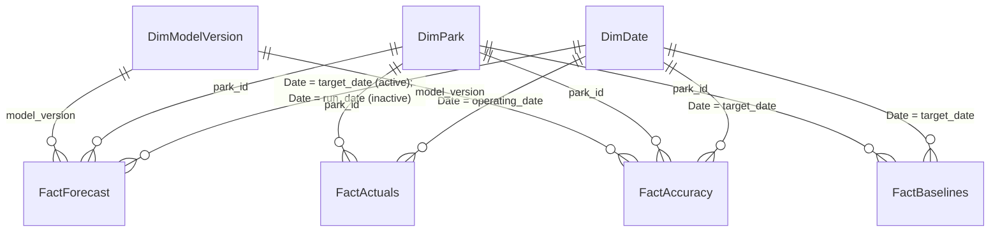

# Chapter 4 — Power BI

The marts from [chapter 2](02-warehouse.md) — `marts.forecasts`, `marts.forecast_accuracy`,
plus actuals from `staging.attendance_daily` — become a Power BI semantic model that
replicates every panel of the PoC dashboard (`public/index.html`) and adds the one thing a
static page cannot: accuracy *trends* over months of history. The static dashboard stays
useful as a public demo; ops and marketing get this model instead.

## 4.1 Semantic model: the star schema

One star, six tables. Grain stated exactly, because two of the facts are easy to get wrong.

| Table | Source | Grain — one row per | Notes |
|---|---|---|---|
| `FactForecast` | `marts.v_forecasts_pbi` (view below) | `park_id × target_date × run_date` | Full append-only history (README ground rule 4). `is_latest_run` flags the row ops should plan on |
| `FactActuals` | `staging.attendance_daily`, or `staging.admissions` aggregated to `park_id × operating_date × ticket_type × sales_channel` for drill | day, or day × ticket/channel | Either grain works: `SUM(entries)` is additive. Keep accuracy facts at day grain regardless |
| `FactAccuracy` | `marts.forecast_accuracy` | `park_id × target_date × horizon_days` | Every horizon the service writes is scored (ch. 3 §3.5); the report's default filters show 1 (day-ahead reference), 7 (weekly adjustments), and — where labor locks monthly — 30. Carries `p50`, `actual_entries`, `abs_error`, `pct_error`, `in_band`, `is_fallback` |
| `FactBaselines` | `marts.baselines` (DDL in §4.4) | `park_id × target_date × baseline_name` | The rule-of-thumb values, precomputed — see §4.4 for why not DAX |
| `DimDate` | `ref.dim_date` view, or DAX `CALENDAR()` | calendar date, contiguous, no gaps | **Mark as date table** (Table tools → Mark as date table), and turn off *Auto date/time* in Options — otherwise every date column grows a hidden calendar |
| `DimPark` | `ref.parks` | `park_id` | `park_name`, `park_tz`, airports; RLS anchor (§4.6) |
| `DimModelVersion` | model registry ([chapter 3](03-pipeline-and-model.md)) | `model_version` | `trained_at`, algorithm blend tag, promotion notes. Must include a `'fallback'` member — fallback rows carry that model_version (ch. 3 §3.5) and would otherwise dangle the relationship |



All relationships single-direction (dimension filters fact), 1:*. `FactForecast` is
**role-playing on dates**: the active relationship is on `target_date` ("what was forecast
*for* this day"); a second, inactive relationship on `run_date` answers "what did we
publish *on* this day", activated per-measure:

```dax
Forecasts Published (selected day) =
CALCULATE (
    COUNTROWS ( FactForecast ),
    USERELATIONSHIP ( DimDate[Date], FactForecast[run_date] )
)
```

The latest-run flag is computed in SQL, not DAX (works identically in PostgreSQL and
DuckDB):

```sql
CREATE OR REPLACE VIEW marts.v_forecasts_pbi AS
SELECT f.*,
       f.run_date = MAX(f.run_date) OVER (PARTITION BY f.park_id, f.target_date)
         AS is_latest_run
FROM marts.forecasts f;
```

Build `DimDate` in the warehouse so weekday logic matches `staging.*` exactly
(`EXTRACT(isodow) `: 1=Mon…7=Sun; sort `weekday_name` by `weekday_no` in the model).
Dialect note: `to_char()` for names in Postgres, `strftime()` in DuckDB. Do **not** put an
`is_holiday` column on `DimDate` in a multi-park model — holidays are per park-country,
so they live on the facts/features, not the shared calendar.

## 4.2 Connectivity: Import, refresh, gateways

**Import mode. Full stop.** Chapter 2 §2.6 sized this warehouse at single-digit MB per
park-year; five parks × ten years fits in one Import model with room to spare, and Import
is what unlocks calculated tables (the what-if parameters in §4.4), full DAX, and instant
visuals. DirectQuery against Postgres works but buys nothing here: the data changes once
or twice a day, and DirectQuery forfeits calculated tables/columns and adds per-visual
query latency — recommend against it in one sentence and move on.

Refresh realities:

| Question | Answer |
|---|---|
| Scheduled refreshes per day | 8 on a Pro workspace, 48 on Premium/Fabric capacity |
| How many this system needs | **1–2**: once after the nightly `forecast_daily` + `score_accuracy` jobs land (07:45 park-local — after `score_accuracy`'s 07:30 SLA, ch. 3 §3.1), optionally once after the 08:15 catch-up run |
| Self-hosted or AWS RDS PostgreSQL from the Service | Requires the **on-premises data gateway** installed on a VM that can reach the database. Yes, even for RDS — "cloud" to you is "on-premises" to the Service |
| Azure Database for PostgreSQL | Connects as a cloud source, **no gateway** |
| DuckDB | **No native connector.** The pipeline exports the marts to parquet; the model imports parquet. A community DuckDB ODBC driver exists — do not build production refresh on it |

The DuckDB → parquet path, concretely:

```sql
-- end of the nightly DAG (DuckDB); Postgres equivalent: COPY ... TO ... (FORMAT csv)
-- or keep PBI pointed at the database directly.
COPY (SELECT * FROM marts.v_forecasts_pbi)    TO 'exports/forecasts.parquet'    (FORMAT PARQUET);
COPY (SELECT * FROM staging.attendance_daily) TO 'exports/actuals.parquet'      (FORMAT PARQUET);
COPY (SELECT * FROM marts.forecast_accuracy)  TO 'exports/accuracy.parquet'     (FORMAT PARQUET);
COPY (SELECT * FROM marts.baselines)          TO 'exports/baselines.parquet'    (FORMAT PARQUET);
```

Land the exports where the Service can read them without a gateway: **ADLS Gen2 or
OneLake** (first-party connectors), or SharePoint/OneDrive at small scale. There is no
first-party generic Amazon S3 connector — if your pipeline lives in AWS, sync the export
folder to ADLS (azcopy/rclone) rather than trying to read S3 directly.

## 4.3 Incremental refresh

Optional at megabytes, but cheap insurance that refresh time stays flat as forecast
history accumulates for years. Requirements: two Date/Time parameters named exactly
`RangeStart` and `RangeEnd`, an M filter that **folds** to the source (Postgres folds;
parquet does not — skip incremental refresh on the parquet path, full loads are fine
there), then the Incremental refresh policy on each table. Works on Pro; only
XMLA-endpoint partition surgery needs Premium/Fabric.

The one non-obvious decision: **partition `FactForecast` on `run_date`, not
`target_date`.** At refresh time Power BI sets `RangeEnd` ≈ now, and forecast rows have
target dates up to ~14 days in the *future* (the D+1..D+14 service window, ch. 3 §3.5) —
a `target_date` filter silently drops the entire forward forecast. `run_date` is always ≤ today, and each day's new run rows land
inside the newest `run_date` partitions.

```m
let
  Source   = PostgreSQL.Database("pg.internal:5432", "parkwh"),
  Fact     = Source{[Schema = "marts", Item = "v_forecasts_pbi"]}[Data],
  // Convert the PARAMETER to the column's type, never the column —
  // wrapping the column in a function breaks query folding.
  Filtered = Table.SelectRows(Fact,
      each [run_date] >= Date.From(RangeStart)
       and [run_date] <  Date.From(RangeEnd))
in
  Filtered
```

| Table | Partition column | Archive | Refresh window | Why that window |
|---|---|---|---|---|
| `FactForecast` | `run_date` | 5 years | last 7 days | idempotent re-runs can rewrite today's rows (ch. 2 §2.4) |
| `FactActuals` | `operating_date` | 5 years | last 7 days | ticketing re-extracts a trailing D−7 window (ch. 1 §1.1) |
| `FactAccuracy` | `target_date` | 5 years | last 14 days | the scorer re-scores the 7-day restatement window nightly (chs. 1, 3); the extra week is margin for late corrections |

## 4.4 The measures (DAX)

Sign convention first, matching `src/build_dashboard.py::_metrics`: error =
`actual − forecast`, so **positive = ran busier than planned** (understaffed), negative =
ran quieter (wasted hours). Every measure below inherits slicers on `DimDate`, `DimPark`,
`DimModelVersion`, and `FactAccuracy[is_fallback]` — keep fallback rows *in* by default
(ops planned on those numbers; that is the point of the ch. 5 fallback policy).

### Accuracy KPIs

```dax
Actual Guests = SUM ( FactActuals[entries] )

MAE (Week) =
CALCULATE ( AVERAGE ( FactAccuracy[abs_error] ), FactAccuracy[horizon_days] = 7 )

MAE (Day) =
CALCULATE ( AVERAGE ( FactAccuracy[abs_error] ), FactAccuracy[horizon_days] = 1 )

WAPE (Week) =
VAR AbsErr = CALCULATE ( SUM ( FactAccuracy[abs_error] ),      FactAccuracy[horizon_days] = 7 )
VAR Act    = CALCULATE ( SUM ( FactAccuracy[actual_entries] ), FactAccuracy[horizon_days] = 7 )
RETURN DIVIDE ( AbsErr, Act )

Bias (Week) =   -- positive = under-forecast on average (plans lean understaffed)
CALCULATE (
    AVERAGEX ( FactAccuracy, FactAccuracy[actual_entries] - FactAccuracy[p50] ),
    FactAccuracy[horizon_days] = 7
)

Within 10% (Week) =   -- pct_error stored as signed fraction (error / actual)
VAR Scored = CALCULATETABLE ( FactAccuracy, FactAccuracy[horizon_days] = 7 )
RETURN DIVIDE (
    COUNTROWS ( FILTER ( Scored, ABS ( FactAccuracy[pct_error] ) <= 0.10 ) ),
    COUNTROWS ( Scored )
)

Band Coverage (Week) =   -- share of days with p10 <= actual <= p90; target ~0.80
VAR Scored = CALCULATETABLE ( FactAccuracy, FactAccuracy[horizon_days] = 7 )
RETURN DIVIDE (
    COUNTROWS ( FILTER ( Scored, FactAccuracy[in_band] ) ),
    COUNTROWS ( Scored )
)
```

The tolerance chart (±5/10/15/20%) generalizes `Within 10%` over a small disconnected
table — create `Tolerance = GENERATESERIES ( 5, 20, 5 )`, rename the column
`Threshold %`, put it on the X-axis:

```dax
Hit Rate @ Tolerance =
VAR Tol    = SELECTEDVALUE ( Tolerance[Threshold %], 10 ) / 100
VAR Scored = CALCULATETABLE ( FactAccuracy, FactAccuracy[horizon_days] = 7 )
RETURN DIVIDE (
    COUNTROWS ( FILTER ( Scored, ABS ( FactAccuracy[pct_error] ) <= Tol ) ),
    COUNTROWS ( Scored )
)
```

### Skill vs the rule of thumb — precompute the baseline in marts

Do **not** compute "same weekday last week" in DAX via `DATEADD(..., -7, DAY)` or a
DimDate weekday self-join. DAX time intelligence shifts *calendar* days over a contiguous
date table; a park calendar has dark days, so T−7 can land on a closed day and the
baseline silently goes blank or picks up a zero. The PoC's `_naive()` in
`src/build_dashboard.py` already handles exactly this (it drops days where the offset has
no actual, with a `min_n` guard) — port that logic once, in SQL, into a mart the ch. 5
fallback policy *also* reads, so the dashboard judges the model against literally the
same numbers the fallback would publish:

```sql
CREATE TABLE IF NOT EXISTS marts.baselines (
  park_id        TEXT NOT NULL,
  target_date    DATE NOT NULL,
  baseline_name  TEXT NOT NULL,   -- 'same_weekday_last_week' | 'same_weekday_last_year'
                                  -- | 'avg_4_same_weekdays'
  baseline_value DOUBLE PRECISION NOT NULL,
  actual_entries DOUBLE PRECISION,          -- filled by score_accuracy
  abs_error      DOUBLE PRECISION,
  abs_pct_error  DOUBLE PRECISION,
  PRIMARY KEY (park_id, target_date, baseline_name)
);
```

```dax
Baseline MAE (SWLW) =
CALCULATE (
    AVERAGE ( FactBaselines[abs_error] ),
    FactBaselines[baseline_name] = "same_weekday_last_week"
)

Skill vs Rule of Thumb % =   -- (baseline MAE − model MAE) / baseline MAE, as in the PoC
VAR B = [Baseline MAE (SWLW)]
RETURN DIVIDE ( B - [MAE (Week)], B )

-- Strict variant: score the model only on days the baseline could cover,
-- mirroring model_mae_same_days in src/build_dashboard.py.
Skill vs Rule of Thumb % (same days) =
VAR BaseDays =
    CALCULATETABLE (
        VALUES ( FactBaselines[target_date] ),
        FactBaselines[baseline_name] = "same_weekday_last_week"
    )
VAR ModelMAE = CALCULATE ( [MAE (Week)], TREATAS ( BaseDays, DimDate[Date] ) )
VAR B = [Baseline MAE (SWLW)]
RETURN DIVIDE ( B - ModelMAE, B )

Baseline Hit Rate @ Tolerance =
VAR Tol = SELECTEDVALUE ( Tolerance[Threshold %], 10 ) / 100
VAR Base =
    CALCULATETABLE ( FactBaselines,
                     FactBaselines[baseline_name] = "same_weekday_last_week" )
RETURN DIVIDE (
    COUNTROWS ( FILTER ( Base, FactBaselines[abs_pct_error] <= Tol ) ),
    COUNTROWS ( Base )
)
```

### Soft days (marketing)

Bottom-quartile detection over whatever window the user has sliced, matching the PoC's
`k = 25%` rule:

```dax
Soft Days Caught =
VAR Scored = CALCULATETABLE ( FactAccuracy, FactAccuracy[horizon_days] = 7 )
VAR K = ROUNDUP ( COUNTROWS ( Scored ) * 0.25, 0 )
VAR SoftActual =
    SELECTCOLUMNS ( TOPN ( K, Scored, FactAccuracy[actual_entries], ASC ),
                    "d", FactAccuracy[target_date] )
VAR SoftPred =
    SELECTCOLUMNS ( TOPN ( K, Scored, FactAccuracy[p50], ASC ),
                    "d", FactAccuracy[target_date] )
RETURN COUNTROWS ( INTERSECT ( SoftActual, SoftPred ) )
-- False alarms = K − [Soft Days Caught]. TOPN keeps ties, so K can
-- occasionally overshoot by a day; acceptable for a KPI card.
```

### The labor-budget panel: two what-if parameters

The PoC's two inputs (`gph`, `rate` in `src/dashboard_template.html::laborRender`)
become numeric-range parameters. Create them by hand as calculated tables (or via
Modeling → New parameter → Numeric range, which generates the same thing):

```dax
Guests per Staff-Hour        = GENERATESERIES ( 5, 120, 1 )
Loaded Cost per Staff-Hour   = GENERATESERIES ( 10, 80, 1 )

GPH Value  = SELECTEDVALUE ( 'Guests per Staff-Hour'[Value], 40 )
Rate Value = SELECTEDVALUE ( 'Loaded Cost per Staff-Hour'[Value], 25 )
```

Both tables stay **disconnected** (no relationships); each feeds a slider slicer on the
labor page. The conversion measures — every number is guest-miss ÷ guests-per-staff-hour,
priced at the loaded rate, exactly as the PoC panel states:

```dax
Wasted Hours =   -- days that ran quieter than planned: paid hours not needed
SUMX (
    CALCULATETABLE ( FactAccuracy, FactAccuracy[horizon_days] = 7 ),
    VAR Err = FactAccuracy[actual_entries] - FactAccuracy[p50]
    RETURN IF ( Err < 0, -Err / [GPH Value], 0 )
)

Shortfall Hours =   -- days that ran busier: coverage gap
SUMX (
    CALCULATETABLE ( FactAccuracy, FactAccuracy[horizon_days] = 7 ),
    VAR Err = FactAccuracy[actual_entries] - FactAccuracy[p50]
    RETURN IF ( Err > 0, Err / [GPH Value], 0 )
)

Wasted Cost   = [Wasted Hours]    * [Rate Value]
Backfill Cost = [Shortfall Hours] * [Rate Value]

Misallocated Hours per Day =
DIVIDE (
    [Wasted Hours] + [Shortfall Hours],
    CALCULATE ( COUNTROWS ( FactAccuracy ), FactAccuracy[horizon_days] = 7 )
)

Staff-Hours Wasted (chart) = - [Wasted Hours]   -- plots below the axis
```

The diverging daily bar chart is a clustered column chart: `DimDate[Date]` on the X-axis,
`[Shortfall Hours]` and `[Staff-Hours Wasted (chart)]` as values. At day grain each
measure covers at most one row, so bars extend up (short, blue) or down (wasted, orange)
per day — a faithful port of the PoC's `laborChart`.

### Rolling trends (the new page)

```dax
WAPE 30d Rolling =
VAR LastDay = MAX ( DimDate[Date] )
RETURN CALCULATE ( [WAPE (Week)],
                   DATESINPERIOD ( DimDate[Date], LastDay, -30, DAY ) )
-- Same pattern for [Band Coverage 30d Rolling] and [Skill 30d Rolling]:
-- wrap the base measure in DATESINPERIOD over the marked date table.
```

## 4.5 Report pages, mapped 1:1 to the dashboard

| PoC panel (`public/index.html`) | Page | Visual | Measures / fields |
|---|---|---|---|
| KPI row | Accuracy | 5 cards | `MAE (Week)`, `Skill vs Rule of Thumb %`, `Bias (Week)`, `Soft Days Caught`, `MAE (Day)` |
| Forecast vs actual + 80% band | Accuracy | Line chart; band via **Analytics pane → Error bars** on the forecast series, upper/lower bound fields = p90/p10 of the latest run, "shaded area" on | `Actual Guests`; `CALCULATE(SUM(p50), is_latest_run)` and likewise p10/p90. Show the band only at day grain — quantiles do not sum |
| Baseline comparison | Accuracy | Clustered bar (multi-measure) | `MAE (Week)`, `MAE (Day)`, `Baseline MAE (…)` per baseline_name |
| Tolerance hit rates | Accuracy | Clustered column, X = `Tolerance[Threshold %]` | `Hit Rate @ Tolerance`, `Baseline Hit Rate @ Tolerance` |
| Band coverage note | Accuracy | Card | `Band Coverage (Week)` |
| Labor budget | Labor | 2 slider slicers (what-if), 4 cards, clustered column | `Wasted Cost`, `Shortfall Hours`, `Backfill Cost`, `Misallocated Hours per Day`; diverging bar per §4.4 |
| Soft-day panel + chips | Marketing | 2 cards + table with icon conditional formatting (✓ flagged / ✗ missed / false alarm) | `Soft Days Caught`, false alarms; per-day flags come cleanest from a small `marts` view if you want the chip detail |
| Weekday bias | Accuracy | Column chart, X = `weekday_name` sorted by `weekday_no`, data colors by rule on sign | `Bias (Week)` |
| Permutation importance | Drivers | Bar chart from `FactFeatureImportance` — written by the training job (`model_version, feature, label, mae_delta`), sliced by `DimModelVersion` | `SUM(mae_delta)` |
| Error-vs-driver scatter | Drivers | Scatter; the PoC's `<select>` becomes a **field parameter** over imported driver columns from `marts.features_daily` | X = field parameter, Y = per-day error, detail = `DimDate[Date]` |
| Feature overlay explorer | Drivers (optional) | Line chart + the same field parameter; 0–1 rescale needs a `DIVIDE(v − MIN, MAX − MIN)` measure per driver — port it only if someone asks; it is a diagnostic, not a decision panel |
| Day-by-day ledger | Ledger | Table | date, `Actual Guests`, latest p50 (week), signed miss, day-ahead p50, miss % |
| Methodology footer | all | Info tooltip page or text box | static text; keep the honest caveats |
| **(new) Accuracy trends** | Trends | 3 line charts over `DimDate[Date]` from full `FactAccuracy` history | `WAPE 30d Rolling`, `Skill 30d Rolling`, `Band Coverage 30d Rolling`; reference line at 0.80 on coverage |
| **(all pages) staleness banner** | every page | Card, top-right | `Latest Run Date` (below), conditional formatting turns it warning-colored when stale |

**The staleness banner** is the visible end of the ch. 5 refresh gate: when a refresh is
skipped, every page says so instead of silently showing old numbers.

```dax
Latest Run Date = CALCULATE ( MAX ( FactForecast[run_date] ), REMOVEFILTERS () )
Forecast Is Stale = IF ( [Latest Run Date] < TODAY (), 1, 0 )
-- Card shows [Latest Run Date]; conditional formatting on [Forecast Is Stale]
-- turns the card's background to the warning color when 1.
```

The Trends page is the payoff of append-only forecasts: the static dashboard can only
ever show one 30-day holdout, but `FactAccuracy` accumulates every scored day, so drift
(ch. 5) becomes visible to stakeholders, not just to the monitoring job.

## 4.6 Security, distribution, licensing

**RLS by park** — one dynamic role covers any number of parks. Filter on `DimPark`; the
1:* relationships propagate it to every fact:

```dax
-- Role "Park Viewer", table filter on DimPark; SecurityUserPark(user_upn, park_id)
-- is a small mapping table maintained in ref.* and imported hidden.
DimPark[park_id]
    IN CALCULATETABLE (
        VALUES ( SecurityUserPark[park_id] ),
        SecurityUserPark[user_upn] = USERPRINCIPALNAME () )
```

A single-park deployment can skip RLS entirely. Distribute via a workspace for the BI
team and a **Power BI app** for ops/marketing viewers (audiences per page: labor page to
ops, soft-day page to marketing); validate roles with *View as* before publishing. Apply
a sensitivity label (e.g. Confidential — attendance is commercially sensitive even though,
per ch. 1, no personal data enters the warehouse) so it travels with exports.

Licensing: report authors need Pro, and viewers also need Pro when the workspace sits on
shared capacity or a small Fabric SKU. On an F64-or-larger Fabric capacity (or legacy
Premium P SKUs) viewers consume content with free licenses, and Premium Per User sits in
between — model the viewer count before assuming capacity pays for itself; prices change,
so check current figures.

Next: [chapter 5](05-operations.md) wires the refresh into the DAG's quality gates, so a
failed `score_accuracy` run blocks the dataset refresh instead of publishing stale KPIs.
