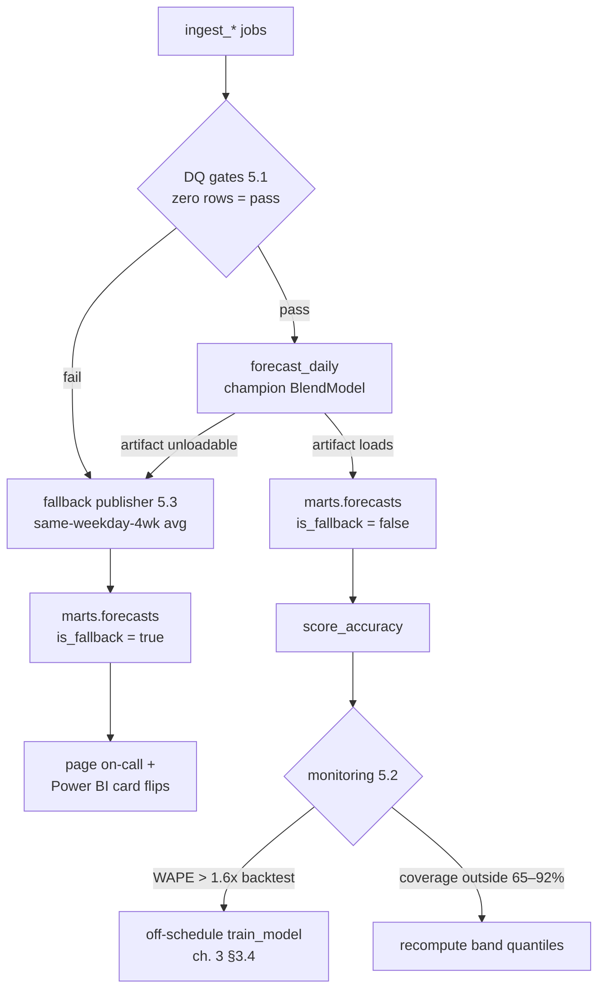

# Chapter 5 — Operations

[Chapter 3](03-pipeline-and-model.md) scheduled the jobs; this chapter keeps them honest.
Everything here serves README ground rule 5: **a missing forecast is an incident; a
fallback forecast is not.** The pieces: quality gates that fail a run before it can
publish garbage, monitoring that compares live accuracy to the promoted model's own
backtest, a precise fallback policy, a runbook, access control, and a backup story sized
to what this system actually is — a daily batch on single-digit megabytes.



## 5.1 Data-quality gates

Every gate is a `SELECT` that must return **zero rows**; any row fails the DAG step, and
`forecast_daily` then follows the fallback policy (§5.3). All SQL below runs unchanged on
PostgreSQL 15+ and DuckDB 1.x (`date - integer`, `percentile_cont ... WITHIN GROUP`, and
`EXTRACT(dow ...)` behave identically in both). Gates take `:run_date` as a bind
parameter — never `CURRENT_DATE` — so a backfilled re-run is judged against *its* date.

dbt tests (`not_null`, `unique`, `dbt source freshness`) or Great Expectations are the
framed-up versions of exactly these checks, and per [chapter 3](03-pipeline-and-model.md)
§3.2 dbt is a fine home for them. Ship the plain SQL first; it has no dependencies and
the DAG runner already knows how to fail on it.

```sql
-- G1  freshness: admissions complete through yesterday (ch. 3 SLA: by 06:00 local)
SELECT p.park_id, MAX(a.operating_date) AS latest_day
FROM ref.parks p LEFT JOIN staging.attendance_daily a USING (park_id)
GROUP BY p.park_id
HAVING MAX(a.operating_date) IS NULL OR MAX(a.operating_date) < :run_date - 1;

-- G2  freshness: tonight's weather-forecast snapshot exists and reaches D+7.
--     (station -> park mapping via ref.park_stations; one station shown for brevity)
SELECT 'weather_snapshot_missing' AS gate
WHERE NOT EXISTS (SELECT 1 FROM raw.weather_forecast_snapshots s
                  WHERE s.snapshot_date = :run_date
                    AND s.target_date  >= :run_date + 7);

-- G3  freshness: tonight's booking snapshot was taken (unrecoverable if not — page)
SELECT p.park_id
FROM ref.parks p
WHERE NOT EXISTS (SELECT 1 FROM raw.booking_snapshots b
                  WHERE b.park_id = p.park_id AND b.snapshot_date = :run_date);

-- G4  volume sanity: yesterday's total within [0.2x, 5x] of the trailing-28-day
--     same-weekday median. Scheduled closure days (Open_Hours = 0) are exempt.
WITH latest AS (
  SELECT a.park_id, a.operating_date, a.entries,
         EXTRACT(dow FROM a.operating_date) AS dw
  FROM staging.attendance_daily a
  JOIN marts.features_daily f
    ON f.park_id = a.park_id AND f.operating_date = a.operating_date
  WHERE a.operating_date = :run_date - 1 AND f."Open_Hours" > 0
), hist AS (
  SELECT l.park_id,
         percentile_cont(0.5) WITHIN GROUP (ORDER BY h.entries) AS med
  FROM latest l
  JOIN staging.attendance_daily h
    ON h.park_id = l.park_id
   AND h.operating_date >= l.operating_date - 28
   AND h.operating_date <  l.operating_date
   AND EXTRACT(dow FROM h.operating_date) = l.dw
  GROUP BY l.park_id
)
SELECT l.park_id, l.entries, h.med
FROM latest l JOIN hist h USING (park_id)
WHERE l.entries < 0.2 * h.med OR l.entries > 5.0 * h.med;

-- G5  schema/null: the feature rows the forecast will read must be whole.
--     Columns quoted to match src/pipeline.py casing (ch. 2 §2.3).
SELECT operating_date, 'null critical feature' AS why
FROM marts.features_daily
WHERE park_id = :park
  AND operating_date BETWEEN :run_date + 1 AND :run_date + 14
  AND ("DayOfWeek" IS NULL OR "Is_Holiday" IS NULL OR "Open_Hours" IS NULL
       OR "Entries_Lag_7" IS NULL OR "Entries_SameDOW_Mean4" IS NULL
       OR "Avg_Temp_C" IS NULL)
UNION ALL
SELECT operating_date, 'negative entries'
FROM marts.features_daily WHERE park_id = :park AND "Entries" < 0;

-- G6  referential: every target date about to be forecast has a feature row.
--     Dialect note: generate_series yields timestamps in PG, hence the CAST;
--     DuckDB accepts the identical text.
SELECT CAST(g.d AS DATE) AS missing_target
FROM generate_series(:run_date + 1, :run_date + 14, INTERVAL '1 day') AS g(d)
WHERE NOT EXISTS (SELECT 1 FROM marts.features_daily f
                  WHERE f.park_id = :park
                    AND f.operating_date = CAST(g.d AS DATE));
```

The runner is deliberately dumb — a name, a query, an exit code:

```python
# jobs/run_gates.py — exit 1 on any failing gate; the scheduler does the rest
import sys
GATES = load_named_queries("sql/gates.sql")          # G1..G6 above
failed = {name: rows for name, q in GATES.items()
          if (rows := conn.execute(q, params).fetchall())}
for name, rows in failed.items():
    print(f"GATE FAIL {name}: {rows[:5]}")
sys.exit(1 if failed else 0)
```

G3 and G2 failing near their retry deadlines (ch. 3 §3.1) page rather than warn: a
snapshot not taken tonight never existed, and the training history is permanently poorer
for it.

## 5.2 Model monitoring

Monitoring reads `marts.forecast_accuracy` ([chapter 2](02-warehouse.md) §2.3) — the
same table every Power BI panel reads — so **every alert threshold below is a multiple
of a number stakeholders can already see on the dashboard.** The KPI semantics are the
PoC's, verbatim from `src/build_dashboard.py::_metrics`: `bias = mean(actual − forecast)`
with positive = under-forecast ("plans lean understaffed" on the KPI card), WAPE =
`sum |err| / sum actual`, band coverage = share of days with `p10 ≤ actual ≤ p90`
(`in_band`), skill = MAE improvement over the best-performing rule-of-thumb baseline
(picked by minimum MAE, as `src/build_dashboard.py` does). An alert
is therefore always explainable by pointing at a visible panel, never a private metric.

The anchor for drift is the **promoted model's own backtest**: extend the registry with
one column, filled at promotion time from the same rolling-origin folds that set
`cv_mae` (ch. 3 §3.4):

```sql
ALTER TABLE marts.model_registry ADD COLUMN cv_wape DOUBLE PRECISION;
```

Daily check, horizon 7 (the decision horizon), fallback days excluded — a fallback day
measures the baseline, not the model:

```sql
WITH acc AS (
  SELECT * FROM marts.forecast_accuracy
  WHERE park_id = :park AND horizon_days = 7 AND NOT is_fallback
), w14 AS (
  SELECT SUM(abs_error) / NULLIF(SUM(actual_entries), 0) AS wape_14,
         AVG(actual_entries - p50)                       AS bias_14,
         AVG(abs_error)                                  AS mae_14
  FROM acc WHERE target_date >= :run_date - 14
), cov30 AS (
  SELECT AVG(CASE WHEN in_band THEN 1.0 ELSE 0.0 END) AS coverage_30,
         COUNT(*) AS n30
  FROM acc WHERE target_date >= :run_date - 30
), skill7 AS (          -- day-by-day vs 'Avg of last 4 same weekdays', read from
  SELECT COUNT(*) AS n, -- marts.baselines (ch. 4 §4.4) so monitor, fallback, and the
                        -- dashboard all quote literally the same baseline numbers
         BOOL_AND(a.abs_error >= b.abs_error) AS model_lost_all
  FROM acc a
  JOIN marts.baselines b
    ON b.park_id = a.park_id AND b.target_date = a.target_date
   AND b.baseline_name = 'avg_4_same_weekdays'
  WHERE a.target_date >= :run_date - 7
)
SELECT w14.*, cov30.coverage_30, cov30.n30,
       (skill7.n = 7 AND skill7.model_lost_all) AS skill_negative_7d
FROM w14, cov30, skill7;
```

| Check | Window | Threshold | Action |
|---|---|---|---|
| `wape_14` vs registry `cv_wape` | rolling 14 d | > **1.3×** | WARN in the ops channel; annotate the dashboard |
| `wape_14` vs registry `cv_wape` | rolling 14 d | > **1.6×** | **Page + fire `train_model` off-schedule** (the drift trigger of ch. 3 §3.4); if the retrain doesn't clear it, open the quarterly sweep early (ch. 3 §3.6) |
| `skill_negative_7d` | 7 consecutive days | baseline beat the model every day | WARN — the model is currently worth less than a spreadsheet; investigate before anyone else notices |
| `coverage_30` | rolling 30 d | outside **[65%, 92%]** | Recompute band quantiles (re-run the band-pool step of ch. 3 §3.4 on current folds). Asymmetric on purpose: the PoC's wider-arm rule means mild over-coverage is designed in; **under** 65% is the dangerous side |
| `ABS(bias_14)` | rolling 14 d | > **0.5 × `mae_14`** | Investigate — check the weekday-bias panel and recent feature drift first; systematic bias is what the blend was chosen to kill (~+90 → ~−7 guests/day, `src/build_dashboard.py` docstring) |
| fallback frequency | rolling 14 d | > 2 days with `is_fallback` | Incident review — the fallback is a parachute, not a commuter vehicle |

Two disciplines make these numbers trustworthy. First, `score_accuracy` re-scores a
trailing 7-day window nightly because admissions data mutates for up to 7 days
(ch. 1 §1.1) — monitoring always reads the re-scored values. Second, thresholds are
compared per park; never pool parks into one WAPE, a good park hides a drifting one.

## 5.3 Fallback policy

Precise triggers, precise behavior, precise exit. This is ground rule 5 made mechanical;
the publishing code is ch. 3 §3.5.

| Trigger | Detected by |
|---|---|
| Champion artifact unloadable (joblib load fails, registry row missing, code/artifact version mismatch) | `forecast_daily` startup |
| Feature staleness beyond contract: G1/G2/G3 failure. (A flight-schedule snapshot older than 14 days is NOT a fallback trigger — the model degrades gracefully by dropping `Curr_*`/`Next_*` features and keeps running, ch. 3 §3.1) | gate runner §5.1 |
| Any other hard gate failure (G4–G6) | gate runner exit code |

**Behavior.** The run still writes all 14 rows to `marts.forecasts`, predictions from
the "Avg of last 4 same weekdays" rule (`_naive([7, 14, 21, 28], min_n=2)` in
`src/build_dashboard.py`; read from `marts.baselines` per ch. 3 §3.5) — chosen for
robustness, not accuracy: it needs only 2 of the 4 prior same weekdays, though in the
shipped demo it was the *weakest* of the three measured baselines. Rows carry
`is_fallback = true`, `model_version = 'fallback'`, and **no band**. It
pages on-call, and it is *visible to ops in the report*, not buried in a log — a Power BI
card bound to the latest run:

```dax
Forecast Status =
VAR LatestRun =
    CALCULATE ( MAX ( FactForecast[run_date] ), REMOVEFILTERS ( FactForecast ) )
VAR FallbackDays =
    CALCULATE (
        COUNTROWS ( FactForecast ),
        FactForecast[run_date] = LatestRun,
        FactForecast[is_fallback] = TRUE ()
    )
RETURN
    IF ( FallbackDays > 0,
         "FALLBACK — rule-of-thumb numbers, no band",
         "Model forecast" )
```

Conditional formatting turns the card red on fallback; [chapter 4](04-powerbi.md) places
it next to the KPI row. Ops planning against a same-weekday average deserves to know it.

**The refresh gate.** `refresh_powerbi` (or the parquet export) is dependency-gated on
`score_accuracy` succeeding — a failed scoring run *skips* the dataset refresh rather
than publishing half-scored KPIs. The report then shows yesterday's data, and the
staleness banner on every page (ch. 4 §4.5) says so. This delivers the promise at the
end of chapter 4: stale-and-labeled beats fresh-and-wrong.

**Exit.** The next successful model run. Nothing is cleaned up: the fallback rows keep
their own `run_date` in the append-only history, the next morning's champion run writes
its own rows, and `score_accuracy` carries `is_fallback` through so fallback days never
contaminate the model-WAPE monitor (§5.2) — they are tracked separately as fallback
frequency. A same-day re-run after fixing the cause overwrites only that `run_date`'s
rows via the natural-key upsert (idempotency, ch. 2 §2.4).

## 5.4 Runbook

Printed form of "what do I do at 06:50 when the phone buzzes." Escalation for a 1–3
person team means: the second person, then the ticketing/IT vendor, then a conscious
decision to run on fallback for N days.

| Symptom | First check | Remediation | Escalate when |
|---|---|---|---|
| Weather or flight API down (snapshot job retrying) | Job log: HTTP status. Provider status page (Open-Meteo / NWS / OAG–Cirium portal) | Let in-window retries run (ch. 3 §3.1). Weather failover is region-aware: US parks `open_meteo_fcst` ↔ `nws_gridpoint`; EU parks `open_meteo_fcst` ↔ the national met service (AEMET/DMI/DWD, ch. 1 §1.4) — NWS covers US locations only. All land with a `source` column. Flights: reuse last schedule snapshot ≤ 14 d old, then degrade (drop `Curr_*`/`Next_*`) | Snapshot deadline passes — the gap is permanent; log it in the data-gap register |
| Ticketing feed late (G1 fails) | Ticketing platform export status / vendor status page | Re-run `ingest_admissions` manually once the feed lands; gates then pass and `forecast_daily` re-runs idempotently | Feed still missing at 09:00 → vendor ticket; publish fallback meanwhile (automatic) |
| Bookings snapshot missed (G3, nearing the 05:45 deadline) | Sales-API auth and quota errors in the job log | Fix and re-fire — if it lands by 08:00, the 08:15 catch-up re-run of `build_features` + `forecast_daily` (ch. 3 §3.1) replaces the morning's fallback rows | Past 08:00: accept the permanent gap, note it; 2+ misses in a month → vendor escalation |
| Forecast row missing for a target date (ops reports no number) | `SELECT * FROM marts.forecasts WHERE run_date = CURRENT_DATE` — is the run absent, or filtered in the report? | Absent: run `forecast_daily` by hand (idempotent). Present but not shown: Power BI refresh (next row) | Neither model nor fallback rows exist — that is the one forbidden state; page immediately |
| Power BI refresh failed / dashboard stale | Refresh history in the Service; staleness banner date on the report (ch. 4) | Retry refresh; if the source query fails, test the DSN from the gateway machine | Two consecutive scheduled refreshes fail |
| On-prem data gateway offline (Postgres path, ch. 4) | Gateway cluster status in Power BI admin; service running on the gateway VM? | Restart the gateway service; check its outbound TLS to the DB | VM itself is gone → restore per §5.6; report meanwhile serves last import |
| Drift page (WAPE > 1.6× backtest) | §5.2 query by hand; then the dashboard's error-vs-driver scatter and weekday-bias panels — is the miss concentrated (one weekday, one weather regime, a new event)? | Off-schedule retrain fires automatically; the promotion gate is fold-MAE-based (ch. 3 §3.4) — verify the challenger clears it | Retrain doesn't clear it in 2 cycles → run the full candidate sweep (ch. 3 §3.6); consider a park regime change |
| Volume-sanity trip (G4) | Yesterday's total vs the ticketing platform's own daily report (ch. 2 §2.5 reconciliation) | Real event (closure, storm): annotate and override the gate for that date. Data bug: fix ingest, re-land the batch, re-run | Totals disagree with the vendor's report by > 2% for 3+ days → reconciliation project, not a hotfix |

**Ownership.** Steady state needs a *named* owner — realistically the data
engineer/analyst who built it (0.1–0.2 FTE, ch. 6 costs this) — plus a named backup who
can execute this runbook. "On-call" here means business-hours response, not a pager
rotation: §5.6 establishes the system tolerates hours of downtime, and the fallback
publishes automatically at 06:30 regardless. Vendor contracts and budget sit with the
owner's manager; the full RACI, including the annual value re-measurement, is in
[chapter 6](06-rollout.md).

## 5.5 Secrets & access

**Starting posture: the PoC needs zero credentials** — a public Kaggle dataset via
`kagglehub`, public EUROCONTROL CSV downloads (`src/pipeline.py`), and a static HTML
output. There are no secrets in this repo and production keeps that property: secrets
exist only in the secret store, referenced by name.

Production adds exactly six: ticketing API key, weather-plan key (Open-Meteo commercial
or none for NWS), OAG/Cirium key, warehouse DSN, model-artifact store URL
(`MODEL_STORE_URL` in the ch. 3 workflow), alert webhook. Store them in **GitHub
Environments** if the scheduler is Actions (the `environment: production` block in ch. 3
§3.2 scopes them and supports approvals), else the cloud secret manager you already have
(AWS Secrets Manager, Azure Key Vault). Rotate on any offboarding; never in `.env` files
on the VM, never in the repo — turn on push protection / secret scanning regardless.

Warehouse access is two roles, no humans in the write path:

```sql
-- PostgreSQL. DuckDB has no GRANT system: the equivalent posture is OS file
-- permissions on the .duckdb file (pipeline user only) and BI reading only the
-- exported parquet marts — BI never opens the database file (ch. 2 §2.1).
CREATE ROLE pipeline_writer LOGIN;   -- password set from the secret store
GRANT USAGE ON SCHEMA ref, raw, staging, marts TO pipeline_writer;
GRANT SELECT, INSERT, UPDATE ON ALL TABLES IN SCHEMA raw, marts TO pipeline_writer;
GRANT SELECT ON ALL TABLES IN SCHEMA ref, staging TO pipeline_writer;
-- note: no DELETE anywhere — raw is immutable, forecasts are append-only (ch. 2)

CREATE ROLE bi_reader LOGIN;
GRANT USAGE ON SCHEMA marts TO bi_reader;
GRANT SELECT ON ALL TABLES IN SCHEMA marts TO bi_reader;
ALTER DEFAULT PRIVILEGES IN SCHEMA marts GRANT SELECT ON TABLES TO bi_reader;
```

TLS is required, not optional: `hostssl`-only rules in `pg_hba.conf` (or the managed
provider's enforce-SSL flag), `sslmode=verify-full` in every DSN, and the Power BI
gateway's connection encrypted the same way.

**PII: no guest data, by design.** The ingest contract ([chapter 1](01-data-sources.md)
§1.1) lands no names, emails, or payment data, and the pseudonymous scan id is dropped at
the staging boundary. The only personal data anywhere in the system are **staff**
identifiers: `entered_by` in the planner-override log (ch. 6) and `user_upn` in the
Power BI RLS mapping (ch. 4 §4.6). List both in the record of processing, limit access to
the BI team, and retire rows when employment ends — that is the entire obligation.

**Retention.** Raw feed landings: keep **≥ 3 years** (the policy floor — long enough for
`Entries_Lag_364` and same-season band folds to have depth; at single-digit MB per
park-year, ch. 2 §2.6, you will in practice keep everything). Snapshot tables
(`booking_snapshots`, `weather_forecast_snapshots`, `flight_schedule_snapshots`):
**forever, no exceptions** — they are the backtest record (ground rule 2) and cannot be
regenerated at any price.

## 5.6 Backup & disaster recovery

Honesty first: **this system tolerates hours of downtime.** The forecast is daily; ops
locks schedules against a number produced once each morning. If the warehouse dies at
07:30, ops runs today on yesterday's published 14-day forecast — which is exactly what
the append-only `marts.forecasts` is for — and the fallback SQL (ch. 3 §3.5) runs by
hand against any surviving copy. Size the DR effort to that: no hot standby, no
multi-region replica, no HA budget line.

| | PostgreSQL | DuckDB |
|---|---|---|
| Mechanism | Managed (RDS / Azure Database for PostgreSQL): automated snapshots + **PITR** — turn them on, done. Self-hosted: nightly `pg_dump -Fc` to versioned object storage (seconds at this volume) | The `.duckdb` file plus the nightly parquet exports of `raw` and `marts` **are** the backup. Copy both to versioned object storage after the DAG finishes (single-writer, so post-DAG the file is quiescent; `EXPORT DATABASE` is the belt-and-braces alternative) |
| RPO | Minutes with PITR; 24 h with dump-only | 24 h |
| What a 24 h RPO actually loses | One day of raw landings — all refetchable (ticketing re-extracts D−7..D, weather archive, flight actuals) **except last night's snapshots**. So: push each snapshot batch to object storage immediately after capture, not only in the nightly backup — that makes snapshots effectively RPO-zero, and they are the only data that deserves it | same |
| Restore | `pg_restore` into a fresh instance | Copy the file back (or `IMPORT DATABASE` from parquet) |

**Quarterly restore drill**, on the calendar, not aspirational: restore the latest
backup to a scratch instance, point `build_features` and `forecast_daily` at it for one
run date, and diff the resulting `marts.forecasts` rows against production's for the
same `run_date`. Row-identical = pass. The drill costs under an hour at this data size,
and it is the only proof the backup is real.

**Code and config recover from git.** Everything declarative lives in the repo: DDL
(ch. 2), job code and the Actions workflows (ch. 3), `config/feature_contract.yml`, the
gates SQL of §5.1, the Power BI project file (ch. 4). Model artifacts live in object
storage keyed by `marts.model_registry.artifact_path`, and worst case a champion is
refit from the warehouse in minutes (`train_model` is deterministic given
`marts.features_daily` and a `random_state`, `src/pipeline.py::RANDOM_STATE`). Cold
start of a dead VM is therefore: provision, `git clone`, `pip install -r
requirements.txt`, inject the six secrets, restore the warehouse, re-run today's DAG.
Rehearse it once; write down how long it took; that number is your real RTO — expect
low single-digit hours, which is within tolerance by design.

Next: [chapter 6](06-rollout.md) — proving the system is worth trusting, phase by
phase, and the labor-savings arithmetic that pays for all of the above.
