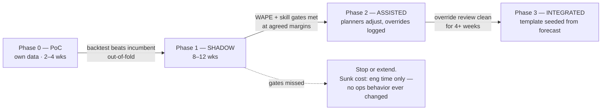

# Chapter 6 — Rollout & the business case

Chapters [1](01-data-sources.md)–[5](05-operations.md) specify the system. This chapter
specifies how it earns the right to run a park: a phased rollout with explicit gates, the
acceptance metrics behind each gate, the labor and marketing business case with its
assumptions on the table, the risks, and the deck to present. The through-line is the
shadow phase: **the system proves itself on the park's own data before anyone changes a
schedule**, and every number in the business case gets replaced by a measured one before
Phase 2 starts.

## 6.1 Phased rollout



| Phase | Duration | What runs | What ops/marketing do | Entry criteria | Exit criteria |
|---|---|---|---|---|---|
| **0 — PoC on your data** | 2–4 wks | This repo pointed at a one-off extract of your ticketing history (a `marts.features_daily`-shaped CSV is enough; no pipeline yet). Run `src/backtest.py` and `src/build_dashboard.py` against it | Nothing. One planner sanity-checks the feature list and the operating calendar | Ticketing extract available; ch. 1 §1.1 data contract fields present ≥ 2 years back | Rolling-origin backtest on **your** data beats your incumbent rule-of-thumb out-of-fold; data-quality surprises catalogued; go/no-go on the build |
| **1 — SHADOW** | 8–12 wks | Full production pipeline (ch. 2–3, 5): daily forecasts written append-only to `marts.forecasts`, scored nightly by `score_accuracy` | **Nothing changes.** Planners keep their current method; they never see the forecast except in review meetings | Chapters 1–5 built; snapshot jobs (bookings, forecast weather) stable ≥ 2 wks; incumbent method's forecasts also logged daily for the same dates | Rolling 8-week WAPE and skill beat the incumbent at the **pre-agreed margins** (§6.2); band coverage in range; fallback days below threshold |
| **2 — ASSISTED** | 4–8 wks | Same, plus the Power BI report (ch. 4) at schedule-lock | Planners open the report when locking the week's schedule (e.g. Mon 09:00 `Europe/Madrid` or `America/New_York`), build the plan from the h = 7 forecast, **adjust freely**, and log every override with a reason code (§6.1.1) | Phase 1 gates passed and signed off by ops lead | Monthly override review (§6.1.1 query) shows overrides are not systematically beating the model; planners agree the report is usable at lock time |
| **3 — INTEGRATED** | ongoing | Same, plus the scheduling template pre-seeded from the h = 7 forecast band | Manager retains full override (logged, as in Phase 2). Marketing uses soft-day flags at T−7 for promo/media timing | Phase 2 exit signed off by ops **and** one marketing cycle has used soft-day flags in anger | Steady state is *conditional*, not permanent — the reversion gates in §6.1.2 move the park back to Phase 2 if the system stops earning its seat |

Two design points worth defending in the room:

- **Shadow requires logging the incumbent too.** "Beat the rule of thumb" is only
  provable if the rule of thumb's daily numbers are on record for the same dates. If the
  incumbent is informal ("last year same week, adjusted by feel"), have planners write
  their number down daily during shadow — one column in a shared sheet, loaded to the
  warehouse weekly. Without this, Phase 1 can only compare against the mechanical
  baselines `src/build_dashboard.py` computes, which may flatter the model.
- **The gates are agreed before shadow starts, not after.** Margins negotiated after
  seeing results convince nobody. Write the §6.2 thresholds into the Phase 1 kickoff
  note and have ops sign it.

### 6.1.1 Override logging (Phase 2+)

Overrides are data, not noise: they either expose model blind spots (a concert the
calendar missed) or planner biases (systematic padding of Saturdays). One table, valid
in PostgreSQL and DuckDB:

```sql
CREATE TABLE marts.planner_overrides (
  run_date      DATE NOT NULL,             -- schedule-lock morning
  target_date   DATE NOT NULL,
  park_id       TEXT NOT NULL,
  model_pred    DOUBLE PRECISION NOT NULL, -- copied from marts.forecasts at lock time
  planner_pred  DOUBLE PRECISION NOT NULL, -- what the schedule was actually built to
  reason_code   TEXT,                      -- 'local_event','weather_doubt','group_booking','judgment'
  entered_by    TEXT NOT NULL,
  entered_at    TIMESTAMP DEFAULT now(),
  PRIMARY KEY (run_date, target_date, park_id)
);
```

The monthly review is one query (works in both engines):

```sql
SELECT date_trunc('month', o.target_date)                    AS month,
       COUNT(*)                                              AS overridden_days,
       AVG(ABS(a.entries - o.model_pred))                    AS model_mae,
       AVG(ABS(a.entries - o.planner_pred))                  AS planner_mae,
       COUNT(*) FILTER (WHERE ABS(a.entries - o.planner_pred)
                            < ABS(a.entries - o.model_pred)) AS planner_wins
FROM marts.planner_overrides o
JOIN staging.attendance_daily a
  ON a.park_id = o.park_id AND a.operating_date = o.target_date
GROUP BY 1 ORDER BY 1;
```

If planners win consistently on a reason code (say `local_event`), that is a missing
feature — feed it back into ch. 1's event calendar work, don't argue with the planners.
That framing is the whole spirit of the review: overrides are **planner knowledge the
model doesn't have yet**, being captured so it can be encoded — not an audit of the
planners. Say that sentence in the Phase 2 kickoff, and have planners co-design the
reason codes themselves; a reason-code list handed down from the BI team reads as
surveillance and breeds the quiet-reversion failure §6.4 warns about.

### 6.1.2 Post-launch reversion gates (Phase 3 → Phase 2)

Entry gates without exit gates are a ratchet; a funder should ask what moves the park
*back*. Any of these, sustained, reverts the park to Assisted (planners build from the
report again, template seeding off) — the decision is made jointly by the system owner
and the exec sponsor (§6.3.1), recorded in the same kickoff-note format as the Phase 1
gates:

| Reversion trigger | Window |
|---|---|
| Skill vs the logged incumbent (or best mechanical baseline) negative | rolling quarter |
| Monthly override review shows planners beating the model on a majority of overridden days | 2 consecutive months |
| Fallback frequency above the ch. 5 operational gate | rolling quarter |
| The annual value re-measurement (§6.3.1) cannot support the recurring cost | annually |

### 6.1.3 The bookings caveat every gate must respect

[Chapter 1 §1.2](01-data-sources.md) calls advance-booking snapshots the single
highest-value feature — and they **will not be in the model during shadow**: snapshots
start accumulating at day zero and need roughly six months of history before the feature
carries weight (ch. 3 §3.6). So Phase 1's gates are judged on a model that is *missing
its best feature*. Two consequences, stated up front so neither surprises anyone:

- If shadow passes without bookings, the go decision is conservative — the system only
  gets better when bookings mature.
- When bookings enter the model (a promoted challenger uses them), run a **Phase 1b
  re-gate**: 4 weeks of shadow-style comparison on the new model before its numbers
  seed anything. The frozen Phase 1 thresholds stay the yardstick; re-gating validates
  the *model change*, not the whole program.

### 6.1.4 Change management is a workstream, not a hope

Phase 1's evidence depends on planners hand-logging their incumbent forecast daily for
8–12 weeks — unpaid extra work that fails silently if it goes spotty. Treat it as a
deliverable with an owner: the ops lead names one person to run the incumbent log, a
weekly completeness check runs alongside the DQ gates (missing days = the gate becomes
unevaluable, which is a *schedule* risk to the program, and is reported as such), and
planner time for logging and for Phase 2 training is budgeted in the plan (§6.3), not
absorbed. The reason codes, as above, belong to the planners.

## 6.2 Acceptance metrics

Every gate metric is a KPI the dashboard already computes (`src/build_dashboard.py`
`_metrics`, `best_baseline`, `band`, `soft`) and the Power BI report re-implements in
DAX (ch. 4 §4.4). **The PoC numbers below come from the `--synthetic` demo build and
are placeholders** — they demonstrate the *measurement machinery*, not the achievable
accuracy. Two of the PoC's shortcuts flatter them further: realized weather and flight
actuals stand in for forecast-time snapshots (flagged in the dashboard footer; fixed by
the as-of snapshot design in ch. 1 and ch. 3 §3.3). Real thresholds are set from Phase 1
shadow data against your park's own incumbent, then frozen.

| Dashboard KPI | PoC synthetic value | How the real threshold is set (Phase 1) |
|---|---|---|
| Week-ahead WAPE (KPI row) | ~10% | Rolling 8-week WAPE must beat the incumbent's logged WAPE by an agreed margin — e.g. ≥ 2 WAPE points absolute or ≥ 15% relative, whichever ops signs |
| Skill vs best rule-of-thumb | +29% vs "same weekday last week" | Positive on every rolling 8-week window in the second half of shadow; margin agreed up front |
| Bias (mean error) | −49 guests/day on a ~9.6k average (−0.5%); the blend's out-of-fold CV bias was ~−7/day vs ~+90 for single XGBoost — two different quantities, both labeled | Rolling 28-day bias within ± an agreed % of average attendance (start at ±2%); persistent one-sided bias fails the gate even if WAPE passes |
| 80% band coverage | 25/30 days (~83%) | Rolling 30-day coverage inside an agreed window around nominal, e.g. 70–90%. Both arms matter: under-coverage breaks trust, heavy over-coverage means a uselessly wide band. (Ops *alerting* uses the deliberately wider [65%, 92%] band of ch. 5 §5.2 — alert late, gate strict) |
| Soft-days caught (bottom-quartile days) | 3/8 in the demo build — honestly weak there | Set with marketing from shadow data: what hit rate at T−7, at what false-alarm rate, makes a promo trigger worth acting on |
| Day-ahead MAE (reference) | ~961 guests on ~9,600 avg | No gate — it is the ceiling that shows how much accuracy the 7-day firewall costs, per ch. 3 §3.5's by-horizon scoring |
| Fallback days (`is_fallback`) | n/a in PoC | Operational gate: e.g. ≤ 2 fallback days per rolling quarter, none consecutive (ch. 5) |

## 6.3 The business case

### The labor math the dashboard already implements

The labor-budget panel (`laborRender` in `src/dashboard_template.html`; DAX port in
ch. 4 §4.4) converts every day's forecast miss into staff-hours and dollars with two
user-set assumptions:

```
staff_hours_missed(d) = |actual(d) − forecast(d)| / guests_per_staff_hour
cost(d)               = staff_hours_missed(d) × loaded_rate
```

Days that ran quieter than forecast are **wasted paid hours**; days that ran busier are
**shortfall hours** — a service-quality hit and overtime/backfill cost. The annual value
of a forecast *improvement* is the same formula applied to the accuracy delta:

```
gross_annual = avg_attendance × (WAPE_incumbent − WAPE_model)
               ÷ guests_per_staff_hour × loaded_rate × operating_days
```

### Worked example — presented as a range, never a point

| Assumption | Value | Where the real number comes from |
|---|---|---|
| Average daily attendance | 15,000 | Your `staging.attendance_daily` |
| Operating days / year | 360 | Your operating calendar |
| Incumbent WAPE | 10% | **Measured in Phase 1** (logged incumbent forecasts) |
| Model WAPE | 7% | **Measured in Phase 1** — the 3-point delta here is illustrative |
| Guests per staff-hour | 40 | Your labor standards; scalable roles only (the panel's default) |
| Loaded cost per staff-hour | $25 | Finance; loaded (wages + taxes + benefits), not base wage. EU: same math in €, e.g. €24–28 typical loaded seasonal rates |
| Capture rate | 30–70% | Scheduling reality: minimum shift lengths, fixed-post roles, union/legal notice periods mean not every saved forecast-hour becomes a saved paid hour |

The arithmetic: a 3-point WAPE improvement on 15,000 guests is 450 fewer mis-forecast
guests per day → 450 / 40 = **11.25 staff-hours/day** → × $25 = ~$281/day → × 360 days ≈
**$101k/year gross misallocation removed**. Applying the 30–70% capture rate:

> **≈ $30k–$71k per year for this one park, at these assumptions** — and every row of
> the table scales it linearly. A 30,000-guest park doubles it; an incumbent already at
> 8% WAPE roughly halves it. Present the formula and the table, let the room plug in
> their numbers — that is literally what the Power BI what-if sliders do (ch. 4 §4.4).

Two honesty notes to say out loud. First, the 10% → 7% delta is not a promise; it is
the *shape* of the claim, and Phase 1 exists to measure the real delta before anyone
spends against it. Second, the two error directions are not symmetric: wasted hours are
a direct P&L line, shortfall hours are queue times, ride throughput, and guest
satisfaction — real but harder to price, which is why the panel reports them separately
instead of netting them.

**The marketing side, qualitatively.** Soft-day flags at T−7 (the `soft` payload /
soft-day panel) give marketing a week to move media weight or trigger a promo at exactly
the lead time media buys are made — that is why the week-ahead model exists at all. The
value depends entirely on promo economics: margin per incremental guest, promo cost and
redemption, and how many flagged days marketing can act on. Do not put a number on it in
the first deck; do commit to measuring it in Phase 3 (flagged days with vs without
intervention).

### The cost side

| Line item | One-time | Recurring | Notes |
|---|---|---|---|
| Build: ch. 1 ingest jobs + data contracts | 2–3 person-weeks | — | Bookings snapshot job is the fiddly one |
| Build: ch. 2 warehouse (DDL, loads) | 1–2 pw | — | DuckDB path is the lighter end |
| Build: ch. 3 pipeline, registry, forecast service | 2–3 pw | — | Model code exists in this repo; the work is jobs + registry |
| Build: ch. 4 Power BI model + report | 1–2 pw | — | DAX for every panel is already written in ch. 4 |
| Build: ch. 5 monitoring, runbook, DR | 1–2 pw | — | |
| Phase 0 PoC on own data | 1–2 pw | — | Cheapest step; do it first |
| Run & improve | — | ~0.1–0.2 FTE | Triage alerts, quarterly backtest sweep, feature work |
| Flight schedule feed (OAG or Cirium) | — | paid, quote-based; plan five figures/yr | **Both regions. Only buy it if Phase 0's backtest shows flight features earn their keep on your data** (ch. 1 §1.3); EUROCONTROL/BTS actuals cover training history either way |
| Weather | — | EU: Open-Meteo **commercial plan** (free tier is non-commercial; low hundreds €/yr — verify current pricing). US: NWS `api.weather.gov` is public domain, $0 | Ch. 1 §1.4 |
| Power BI Pro | — | ~$14/user/month (verify current price), ~3–10 users | Ch. 4 §4.6; report consumers need Pro too unless on Premium/Fabric capacity |
| Infrastructure | — | tens of $/month | The whole pipeline is one small VM (2 vCPU / 8 GB) or serverless workers + GitHub Actions (ch. 3 §3.2). DuckDB removes the DB server entirely |

Total build: **roughly 8–14 person-weeks** for a team that has read this guide, spread
across a 1–3 person team. The dominant recurring cost is the schedule feed — which is
exactly why it is gated on evidence, not bought on day one.

### Net of costs: payback, not just benefit

The benefit range means nothing to a funder until it is netted. At a loaded engineering
rate of $4–7k/person-week, 8–14 pw of build is **$32k–$98k one-time**; recurring is
0.1–0.2 FTE (~$12k–$35k/yr loaded) plus vendors. Two scenarios, one park, mid-range
build cost (~$60k):

| | No schedule feed (default start) | With feed (only if Phase 0 earns it) |
|---|---|---|
| One-time | ~$60k build | ~$60k build |
| Recurring/yr | ~$20k FTE + ~$1k weather/licenses + ~$1.5k Power BI + infra | + five-figure feed (say $25k) |
| Benefit/yr (mid) | ~$50k | ~$55–65k (the feed must *prove* its increment in the backtest) |
| **Payback** | **~2 years** one park; **~1 year at two parks** (build cost is shared; per-park benefit is not) | Feed can consume its own increment — this is why it is evidence-gated |

Year 1 at a single park is roughly break-even to negative; the case turns on year 2 and
on multi-park reuse. Present it that way — a funder who finds the negative year 1
themselves stops trusting the rest of the deck. Two structural cost advantages belong in
the same table talk: **no guest personal data** means no DPIA, a fast security review,
and a low vendor-risk tier — typically weeks of procurement time saved — and the
**one-small-VM footprint** prices the alternative honestly: demand-forecasting SaaS
quotes or a data-platform hire both start at multiples of this system's entire annual
run cost.

### Elapsed time to first captured dollar

Person-weeks hide calendar time on a part-time team. Honest timeline from funding:

| Milestone | Elapsed from funding |
|---|---|
| Phase 0 verdict (backtest on own data) | month 1–2 |
| Build complete, snapshots stable | month 4–7 (8–14 pw part-time) |
| Phase 1 shadow verdict | month 6–10 |
| Phase 2 assisted, overrides logged | month 7–12 |
| Phase 3: first schedule seeded from the forecast — **first captured dollar** | **month 9–15** |

Bookings snapshots start accumulating at build start, so the model's best feature
matures at roughly month 10–13 — conveniently near Phase 3 (§6.1.3).

### 6.3.1 Ownership (RACI, and the year-2 question)

| Role | Who | Owns |
|---|---|---|
| System owner | The data engineer/analyst who built it (named, in writing) | Daily operation per the ch. 5 runbook, quarterly backtest sweep, feature roadmap |
| Backup operator | Second team member | Can execute the runbook and a cold-start restore (drilled in Phase 1, §6.4 bus-factor row) |
| Budget & vendor owner | System owner's manager | Weather plan, schedule feed contract, Power BI licenses |
| Exec sponsor | The ops or finance leader who approved the ask | Phase-gate sign-offs, reversion decisions (§6.1.2) |
| Incumbent-log owner (Phases 1–2) | Named by the ops lead | Daily incumbent logging + weekly completeness check (§6.1.4) |

**The year-2 question — "is it still paying?" — gets a standing answer:** every 12
months, re-measure realized value against the *signed Phase 1 gates* using the same
accuracy history the Trends page shows (ch. 4), price it with the current capture-rate
assumption, and put the one-pager in front of the sponsor. If it cannot support the
recurring cost, §6.1.2's last reversion gate applies.

## 6.4 Risks & mitigations

| Risk | Early signal | Mitigation (and where it is built) |
|---|---|---|
| **Regime break** (COVID-class closure, reopening ramp, new competitor) | Drift monitor fires; fold median ratios stray | The band method already drops any fold whose median actual/forecast ratio strays > 15% from 1.0 as a regime break, and takes the wider of recent vs same-season arms (`src/build_dashboard.py`, ch. 3 §3.4). Drift-triggered retrain (ch. 5) refits within days; if features go stale the fallback baseline publishes with `is_fallback = true` — ops always has a number (ground rule 5) |
| **Data feed fragility** (API change, vendor outage, silent schema drift) | DQ gates and freshness checks fail (ch. 5) | Snapshot jobs page and retry aggressively because their gaps are unrecoverable (ch. 3 §3.1); everything else backfills. Feature builder degrades per-family (e.g. drop `Curr_*`/`Next_*` on a stale schedule snapshot) rather than failing whole |
| **Bus factor of a 1–3 person team** | Only one person can run a backfill | **The repo is the documentation**: this guide, the runbook (ch. 5), the feature contract as YAML (ch. 3 §3.3), and every job in version control. Acceptance test for the risk: a second person executes a cold-start restore and a one-week backfill from docs alone, once, during Phase 1 |
| **Model plateau / silent obsolescence** | Skill vs baseline trends toward zero; repeated drift retrains | The quarterly `src/backtest.py` sweep re-earns the blend against the full candidate zoo on current data (ch. 3 §3.6) — the model keeps its seat by evidence, not incumbency. New feature families (bookings, school calendars) trigger off-schedule sweeps |
| **Stakeholder trust collapse** (one bad weekend erases goodwill) | Planners quietly revert to the old method; override rate climbs | Shadow phase means the first number ops ever acts on has 8–12 weeks of receipts. The accuracy page (ch. 4 §4.5) stays permanently visible — misses included — and the append-only `marts.forecasts` answers "what did we tell ops last Tuesday" exactly (ground rule 4). Override logging keeps disagreement visible and reviewable instead of silent |
| **Licensing surprise** | Legal review of vendor/source terms | Settled in ch. 1 §1.6 before build: EUROCONTROL terms verified for commercial use, Open-Meteo on a commercial plan or replaced by national met services, US government sources (NWS, TSA, BTS, FAA) public domain, OAG/Cirium under contract |

## 6.5 What to present

**Lead with the ask — it is the strongest slide in the deck.** The funding decision is
made on the *shape of the risk*, not on the architecture: fund Phase 0 + Phase 1 only;
no schedule feed, no ops change, and a cheap, explicit kill point if the gates miss
(the phase diagram prices the failure case: sunk cost is eng time only). Open with that
slide, then let the evidence slides carry the Q&A:

1. **The ask & the risk containment** (this chapter): Phase 0+1 only, gates signed
   before shadow, kill cheaply, zero ops change until the system beats the incumbent on
   our own data.
2. **The decision, not the model** (README): schedules lock and media is bought ~7 days
   out; the system forecasts at exactly that horizon and proves it with a firewall.
3. **Data you already own, plus public feeds** (ch. 1): ticketing + bookings are the
   core; weather, flights, holidays are commodity — with the licensing table shown, not
   hidden. No guest personal data by design — procurement and security review move fast.
4. **It fits on one small VM** (ch. 2): Postgres or DuckDB, hundreds of rows a day; no
   platform project — and price the alternative (SaaS or platform build) on the slide.
5. **Why this model** (ch. 3): the backtest ranking table (the `lgbm+ridge+rf equal
   (SHIPPED)` entry in `src/backtest.py`), labeled **provisional — measured on the
   synthetic demo set**; the blend beat single XGBoost by ~6% out-of-fold MAE there and
   the MLP and per-weekday corrections lost. The slide's punchline is not the ranking —
   it is that **Phase 0 re-runs this exact sweep on our own data** before anything is
   trusted, and re-runs it quarterly forever (ch. 3 §3.6).
6. **What planners actually see** (ch. 4): the report page mapped 1:1 to the demo
   dashboard.
7. **When it breaks** (ch. 5): fallback policy — a missing forecast is an incident, a
   fallback forecast is not.
8. **Money** (this chapter): the benefit range with assumptions visible, the netted
   payback table (§6.3), the elapsed timeline, and who owns it in year 2 (§6.3.1).

**Demo flow** (10 minutes, live): open the dashboard (`public/index.html` — say plainly
it is the synthetic demo build) and walk the KPI row → forecast-vs-actual with the 80%
band → the accuracy/baseline panels ("here is where it admits its misses") → switch to
Power BI and drive the labor what-if with the room's own guests-per-staff-hour and
loaded rate → end on the soft-day panel for the marketing stakeholders.

**The ask.** Approve **Phase 0 + Phase 1**: 2–4 weeks of PoC on our own extract, then
8–12 weeks of shadow running — eng time plus at most the weather plan, no schedule
feed until the backtest justifies it, and **zero change to operations** until the
system beats our current method, on our own data, at margins we sign off today.
