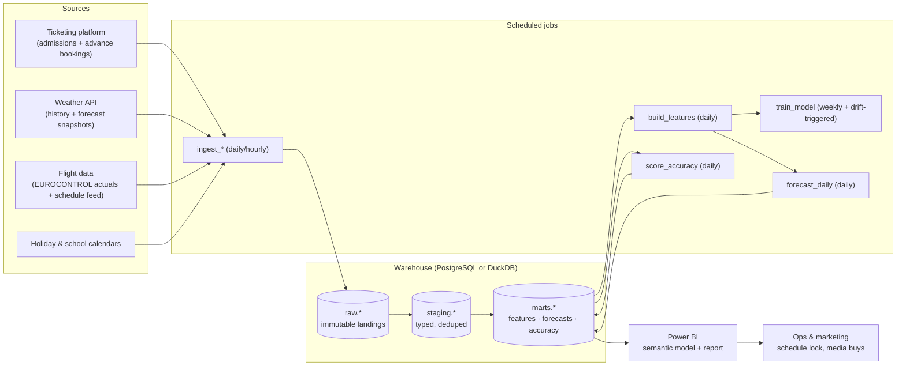

# Production Guide — Attendance Forecasting with Your Own Ticketing Data

This guide takes the proof-of-concept in this repository and specifies a
production deployment of it for a real park: same public APIs where they hold
up, **your own ticketing/admission data** in place of the Kaggle set, a
PostgreSQL or DuckDB warehouse in the middle, and **Power BI** as the reporting
surface. Every chapter maps back to code that already exists in `src/` so the
gap between the PoC and the production system is explicit, not hand-waved.

**Who this is for.** A data/BI team of 1–3 people standing this up for one or
a handful of parks, and the operations & marketing stakeholders who will
consume the forecast. Nothing here assumes a big-data platform; a single
Postgres instance or a DuckDB file handles this volume (a park generates
hundreds of rows a day, not millions).

**Region coverage.** The PoC's public sources are European (EUROCONTROL,
Spanish holidays). The guide is written for **US and EU deployments alike**:
every region-specific source has a named counterpart (US: NWS/NOAA weather,
TSA checkpoint throughput, BTS T-100 and FAA airport-operations data, federal
plus state holiday calendars), and timezone/operating-day examples cover both
`Europe/Madrid` and `America/New_York`. Flight *schedules* — needed for the
forward-looking features in either region — come from commercial vendors
(OAG, Cirium); the free public feeds publish actuals with a lag, which only
serves trailing features and backfill.

## Chapters

| # | Chapter | What it covers |
|---|---------|----------------|
| 1 | [Data sources & contracts](01-data-sources.md) | Your admission data contract, advance-booking snapshots, EUROCONTROL flights (and why production needs *schedules*, not actuals), forecast-weather snapshots, holidays, licensing |
| 2 | [The warehouse](02-warehouse.md) | PostgreSQL vs DuckDB decision, raw → staging → marts layers, full DDL, idempotent loads, timezone & operating-day discipline |
| 3 | [Pipeline & modeling](03-pipeline-and-model.md) | Job DAG with schedules/retries/SLAs, feature freshness contract (the leakage firewall), training cadence, model registry, promotion gates, the forecast service |
| 4 | [Power BI](04-powerbi.md) | Star schema, Import vs DirectQuery honestly, refresh & gateway realities, the DAX for every dashboard panel including the labor-budget what-if, RLS, incremental refresh |
| 5 | [Operations](05-operations.md) | Data-quality gates, model monitoring & drift alerts, fallback policy, runbook, secrets & access, backup/DR |
| 6 | [Rollout & business case](06-rollout.md) | Shadow → assisted → integrated phases, acceptance metrics, the labor-savings business case, what to present |

## The system at a glance

The model itself is the one this repo ships: an **equal-weight blend of
LightGBM (L1), one-hot Ridge, and a random forest** on a log1p target
(`src/build_dashboard.py::BlendModel`), selected by rolling-origin backtest —
`src/backtest.py`, whose candidate zoo includes the shipped blend itself (the
`lgbm+ridge+rf equal (SHIPPED)` entry) alongside single XGBoost variants,
per-weekday corrections, an MLP, and two-member blends, all of which lost on
out-of-fold MAE. Re-run the sweep on your own data before trusting the
ranking; the shipped numbers come from the synthetic demo set. The two-horizon design carries
over unchanged: a **week-ahead** model restricted to features knowable 7+ days
out (when schedules lock and media is bought) and a **day-ahead** reference
ceiling.

## What changes between the PoC and production

| Concern | PoC (this repo) | Production |
|---|---|---|
| Attendance | Kaggle daily CSV | Your ticketing platform, landed raw with load lineage (ch. 1–2) |
| Flights, future windows | EUROCONTROL *actuals* used as a stand-in | A published **schedule** feed for `Curr_*`/`Next_*` features; EUROCONTROL actuals only for trailing windows and backfill (ch. 1) |
| Weather | Realized weather everywhere (flagged as flattering in the dashboard footer) | **As-of forecast snapshots**: features use "what the forecast said 7 days before the target", stored immutably (ch. 1–2) |
| Bookings | Absent (the pipeline has a `Booked_*` hook) | Advance-booking snapshots — the single highest-value production feature (ch. 1) |
| Storage | In-memory DataFrames | raw/staging/marts in Postgres or DuckDB, idempotent upserts (ch. 2) |
| Orchestration | One script, run by hand | Scheduled DAG with retries, SLAs, and quality gates (ch. 3, 5) |
| Model lifecycle | Retrained on every dashboard build | Versioned registry, weekly retrain, champion/challenger promotion gate (ch. 3) |
| Uncertainty band | Out-of-fold ratio quantiles, recent + same-season pools | Same method, recomputed at each training run, coverage tracked daily (ch. 3, 5) |
| Reporting | Static HTML on Vercel | Power BI semantic model; the static page can remain as a public demo (ch. 4) |
| Failure handling | None | Fallback forecast, alerting, runbook (ch. 5) |

## Ground rules that hold everywhere

1. **The leakage firewall is a data contract, not a code comment.** Every
   feature has a declared earliest-availability lag (ch. 3). The week-ahead
   model may only read features whose lag ≥ 7 days. CI enforces it.
2. **Never train on data the warehouse didn't have at the time.** Forecast
   weather, bookings, and flight schedules are stored as *snapshots keyed by
   the date they were taken*, so backtests replay exactly what would have been
   known.
3. **Idempotent everything.** Every job can be re-run for any date range
   without duplicating rows (natural keys + upserts, ch. 2).
4. **The forecast table is append-only history.** Each run writes new rows
   keyed by `(run_date, target_date)`; you can always answer "what did we tell
   ops last Tuesday?" (ch. 2–3).
5. **A missing forecast is an incident; a fallback forecast is not.** If the
   model fails, the pipeline publishes the same-weekday baseline with
   `is_fallback = true` and alerts — ops always has a number (ch. 5).

## Suggested reading order

Read chapters 1→6 for the full build. If you are evaluating feasibility for a
presentation, read this page, then chapter 6 (rollout & business case), then
skim chapter 4 to see what stakeholders would actually look at.
